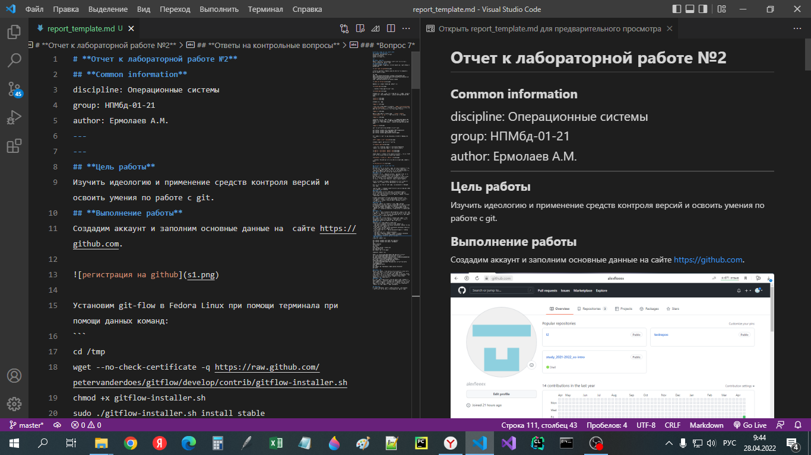
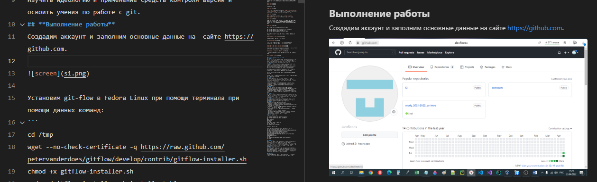
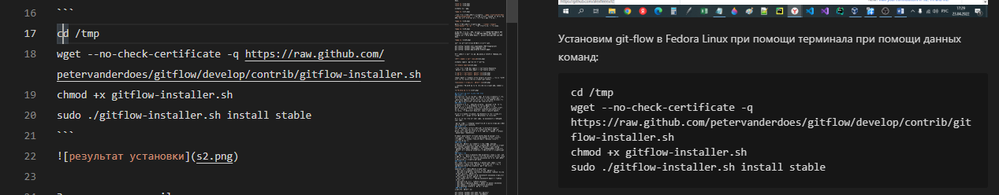
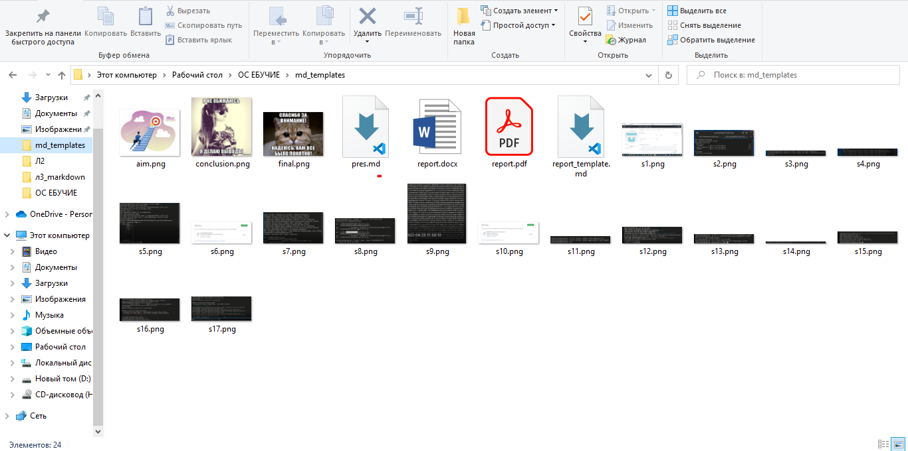

# **Отчет к лабораторной работе №3**
## **Common information**
discipline: Операционные системы  
group: НПМбд-01-21  
author: Ермолаев А.М.
---
---
## **Цель работы**

Научиться оформлять отчёты с помощью легковесного языка разметки Markdown.

## **Выполнение работы**

Создадим файл с разрешением md, откроем его(я буду использовать текстовый редактор VSCode). После чего скопируем шаблонную разметку по ссылке https://github.com/yamadharma/academic-laboratory-report-template/blob/master/report/report.md

 

Создадим подобие титульного листа и пропишем цель работы.

 

Добавим первое изображение. Данный тег имеет следующий синтаксис:
```

```
Для корректных отображения на Github и конвертации создадим папку, в которую мы сохраним сам md файл и все локальные фотографии

 

Также используем тег для работы с кодом.



В дальнейшем отчет будет иметь аналогичную структуру.

После работы с md файлом конвертируем файл в docx при помощи команды
```
pandoc <имя md файла> -o <имя и расширение нового файла>
```
Затем после просмотра и редактирования docx файлв конвертируем его в pdf аналогичным или любым другим способом.

По окончании работы папка с отчетом содержит md, docx и pdf файлы и необходимые изображения.



## **Вывод**
Во время выполнения данной работы я научился оформлять отчёты с помощью легковесного языка разметки Markdown.