# **Отчет к лабораторной работе №3**
## **Common information**
discipline: Операционные системы  
group: НПМбд-01-21  
author: Ермолаев А.М.
---
---
## **Цель работы**
Приобретести практический навык взаимодействия пользователя с системой посредством командной строки.

## **Выполнение работы**
1)Определим полное имя вашего домашнего каталога, воспользовавшись командой ```pwd```:

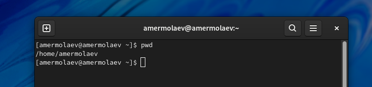

2)Перейдем в каталог /tmp. Так сложилось, что изначально на виртуальной машине не было данного каталога, поэтому пришлось создать его, воспользовавшись командами 
```
sudo mkdir /tmp
sudo chmod 1777 /tmp
```
После создания и перехода в этот каталог команда ```ls``` c различными опциями позволила увидеть, что данный каталог хранит в себе лишь родительский и текущий каталоги.

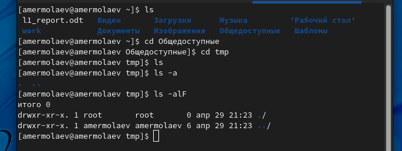

Перейдем в каталог /var/spool при помощи команды cd и выведем содержимое командой ls.

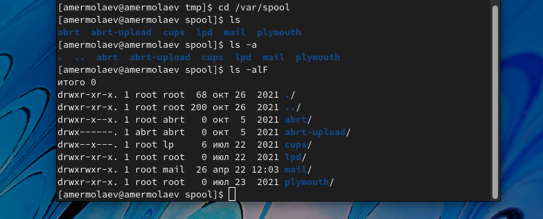

Видно, что подкаталога cron в данной директории нет. 

Перейдите в домашний каталог и выведtv на экран его содержимое командой ls.

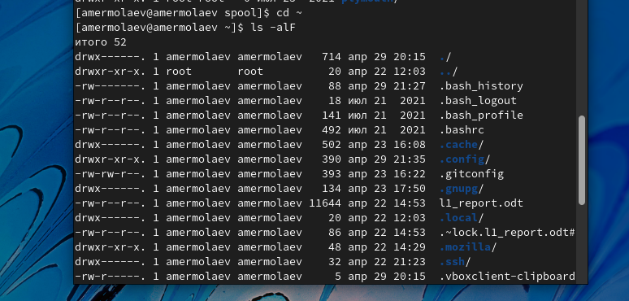

 Видно, что владельцем каталогов и подкаталогов является amermolaev.

3)В домашнем каталоге создадим новый каталог с именем newdir. В каталоге ~/newdir создадим новый каталог с именем morefun.

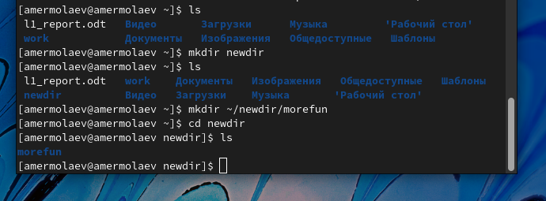

В домашнем каталоге создадим одной командой три новых каталога с именами letters, memos, misk. Затем удалим эти каталоги одной командой.


Попробуем удалить ранее созданный каталог ~/newdir командой rm, однако получим ошибку, так как newdir является директорией и содержит подкаталоги.

Удалим каталог ~/newdir/morefun из домашнего каталога при помощи команды rmdir. Аналогичным образом удалим каталог newdir.

4)С помощью команды ```man ls``` выведем в терминал все опции команды ls. Нас интересует опция R, используемая для просмотра содержимого не только указанного каталога, но и подкаталогов,
входящих в него.

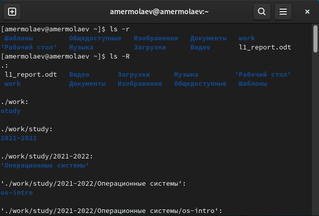

5)Аналогичным образом выеберем опцию t, позволяющую отсортировать по времени последнего изменения выводимый список содержимого каталога с развёрнутым описанием файлов.


6)Воспользуемся командой man для просмотра описания следующих команд: cd, pwd, mkdir, rmdir, rm.

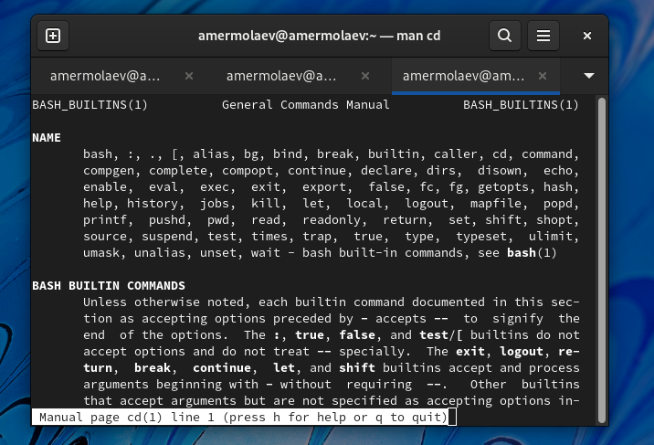
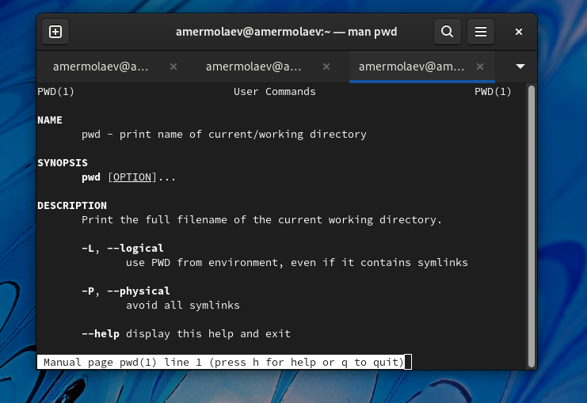
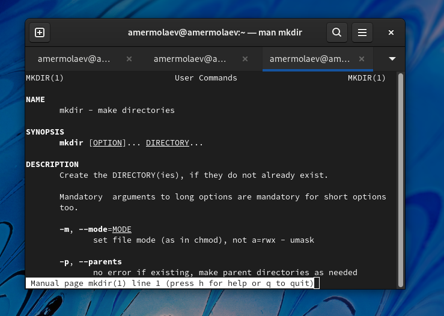
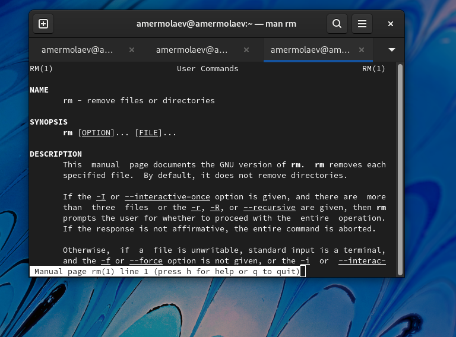
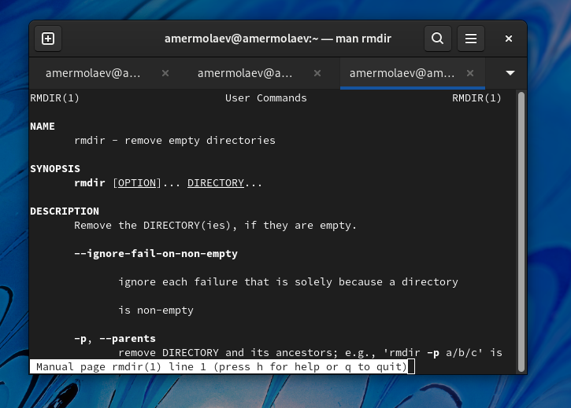

7)Используя информацию, полученную при помощи команды history, выполним модификацию и исполнение нескольких команд из буфера команд.

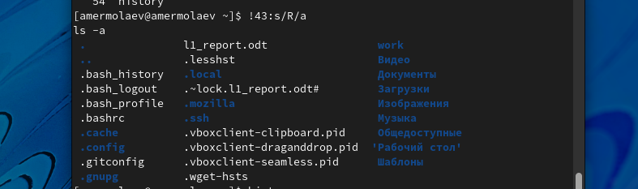

## **Ответы на контрольные вопросы**
### *Вопрос 1*
Командная строка представляет собой программное средство ввода команд пользователем и получения результатов их выполнения на экране.
### *Вопрос 2*
Определить абсолютный путь текущего каталога можно при пощощи команды pwd:
```
pwd
/afs/dk.sci.pfu.edu.ru/home/d/h/dharma
```
### *Вопрос 3*
Определить только тип файлов и их имена в текущем каталоге можно с помощью команд ls и ls -a.

### *Вопрос 4*
Информацию о скрытых файлах можно отпобразить при мпомощи команды ```ls -a```. Такие файлы обычно используются для настройки рабочей среды.
### *Вопрос 5*
Удалить файл можно при помощи команды rm, каталог - при помощи rmdir. Такде можно удалять несколько файлов и каталогов одной командой, указывая имя файлов через пробел.
```
rmdir l1 l2 l3
rm f1.txt f2.txt
```
### *Вопрос 6*
Вывести информацию о последних выполненных пользователем командах можно при помои команды history.
### *Вопрос 7*
Модификация команд имеет следующий синтаксис: 
```
!<номер_команды>:s/<что_меняем>/<на_что_меняем>
```
```
!3:s/a/F
ls -F
```
 ### *Вопрос 8*
Если требуется выполнить последовательно несколько
команд, записанный в одной строке, то для этого используется символ точка с запятой:
```
cd; ls
```
### *Вопрос 9*
Экранирование -- это способ заключения в кавычки одиночного символа. Экранирующий (escape) символ (```\```) сообщает интерпретатору, что следующий за ним символ не должен восприниматься как обычный символ.
Примеры специальных символов: ```. / *```.
### *Вопрос 10*
При использования команды ```ls -l``` для каждой директории выведется подробный список, в котором будет отображаться владелец, группа, дата создания, размер и другие параметры.
### *Вопрос 11*
Относительный путь представляет собой путь по отношению к текущему рабочему каталогу пользователя или активных приложений.
```
cd ~\Desktop
cd Desktop
```
В результате выполнение обеих команд мы перейдем в директорию Desktop.
### *Вопрос 12*
Команда man используется для просмотра (оперативная помощь) в диалоговом режиме руководства (manual) по основным командам операционной системы типа Linux.
### *Вопрос 13*
Клавиша TAB  служит для автоматического дополнения вводимых команд.
## **Вывод**
В рамках выполнения работы я приобрел практический навык взаимодействия пользователя с системой посредством командной строки.