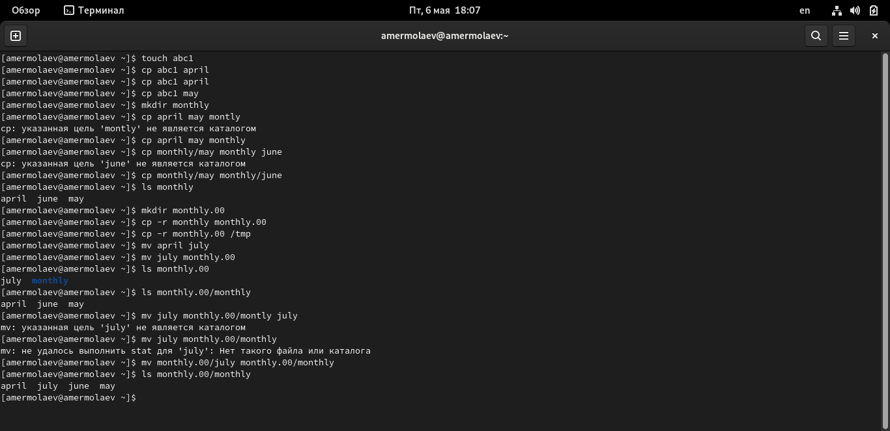
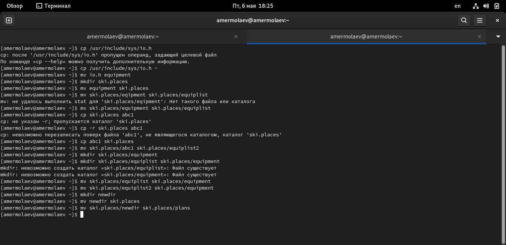
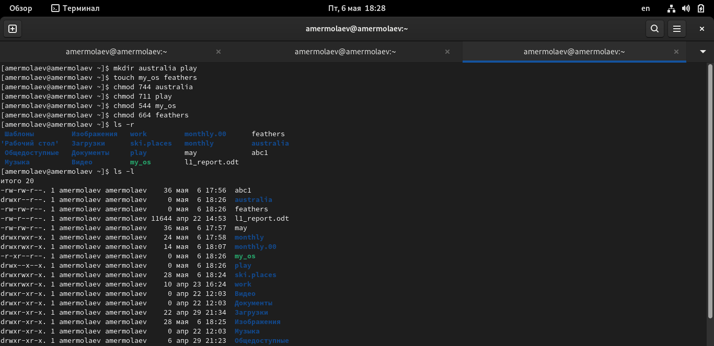
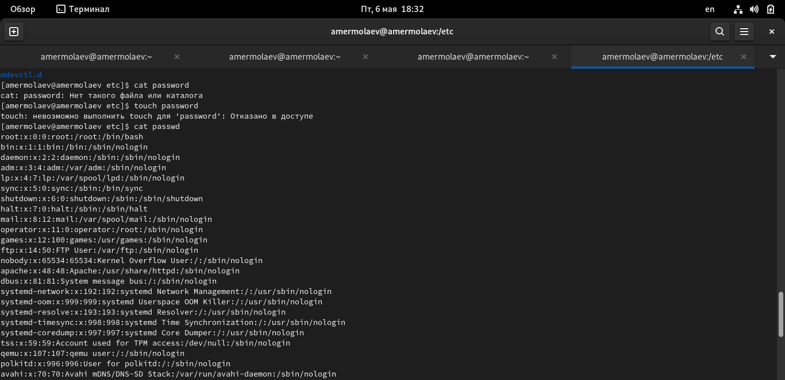
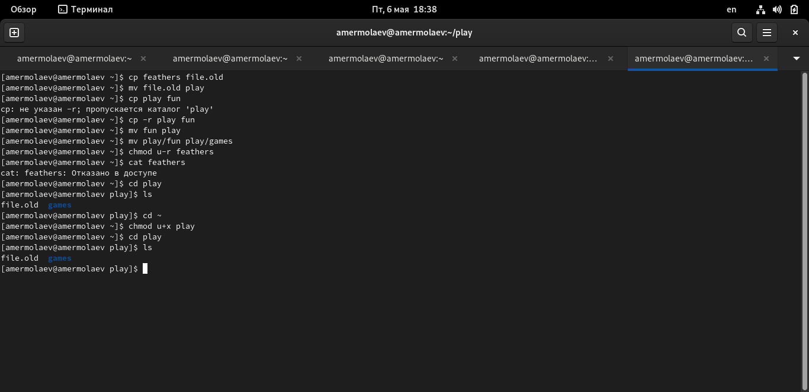
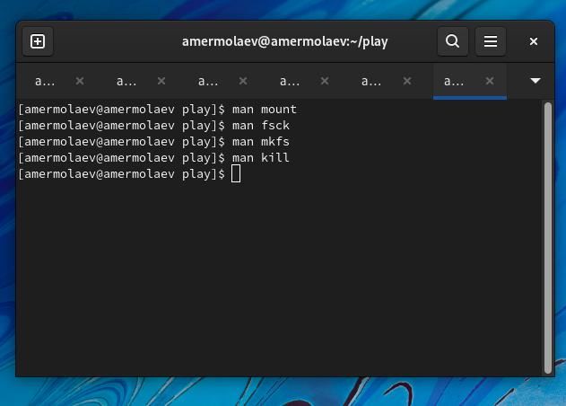

---
## Front matter
lang: ru-RU
title: Презентация к лабораторной работе №5
author: Ермолаев А.М.
group: НПМбд-01-21

## Formatting
toc: false
slide_level: 2
theme: metropolis
header-includes: 
 - \metroset{progressbar=frametitle,sectionpage=progressbar,numbering=fraction}
 - '\makeatletter'
 - '\beamer@ignorenonframefalse'
 - '\makeatother'
aspectratio: 43
section-titles: true
---

# Презентация к лабораторной работе №2

# Цель работы

Цель работы: Ознакомление с файловой системой Linux, её структурой, именами и содержанием
каталогов. Приобретение практических навыков по применению команд для работы
с файлами и каталогами, по управлению процессами (и работами), по проверке использования диска и обслуживанию файловой системы.

# Выполнение работы

## Выполнение пункта 1

## Выполнение пункта 2

## Выполнение пункта 3

## Выполнение пункта 4

## Выполнение пункта 5

# Вывод
## В ходе данной лабораторной работы я ознакомился с файловой системой Linux, её структурой, именами и содержанием каталогов. Приобре практические навыки по применению команд для работы с файлами и каталогами, по управлению процессами (и работами), по проверке использования диска и обслуживанию файловой системы.

# Финал
