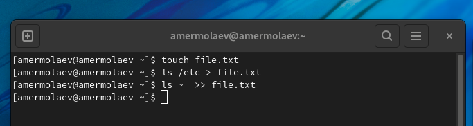
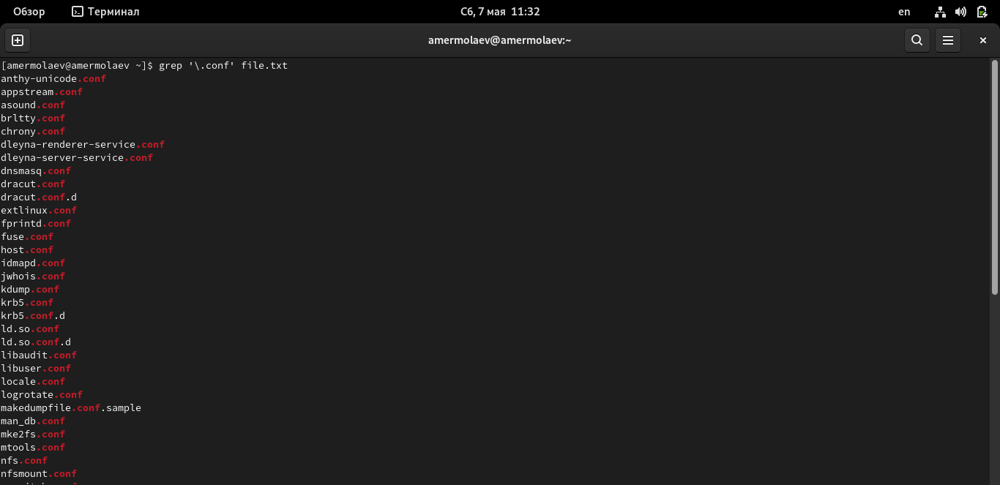
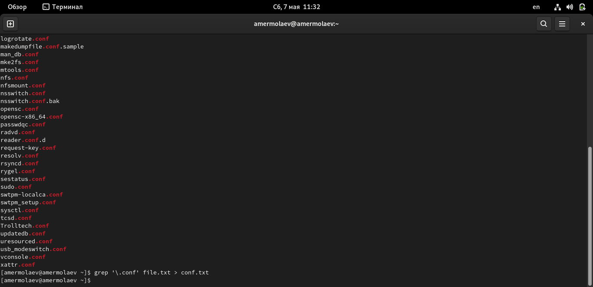
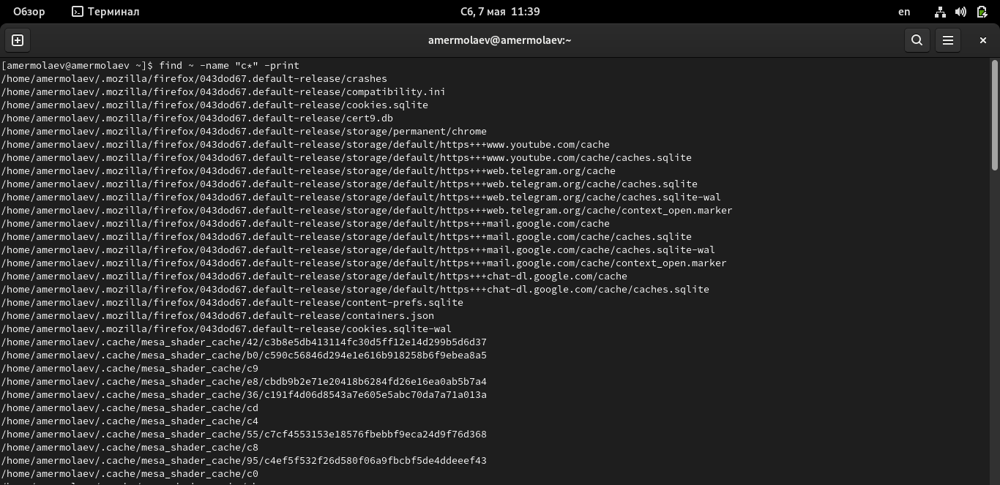
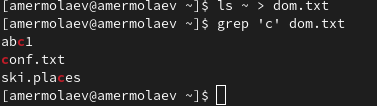
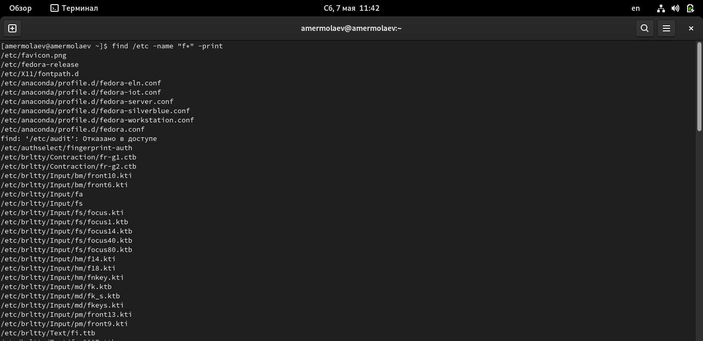
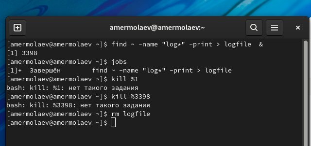
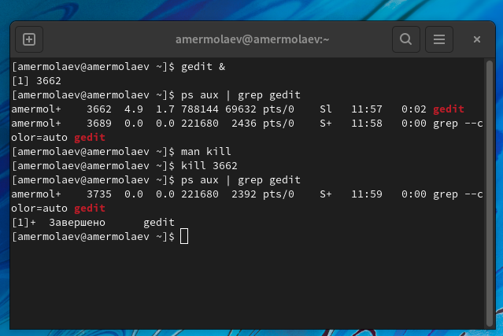
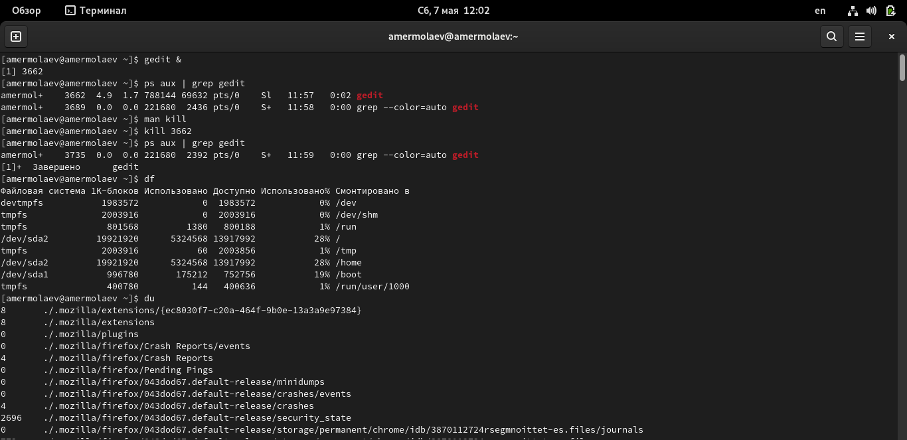
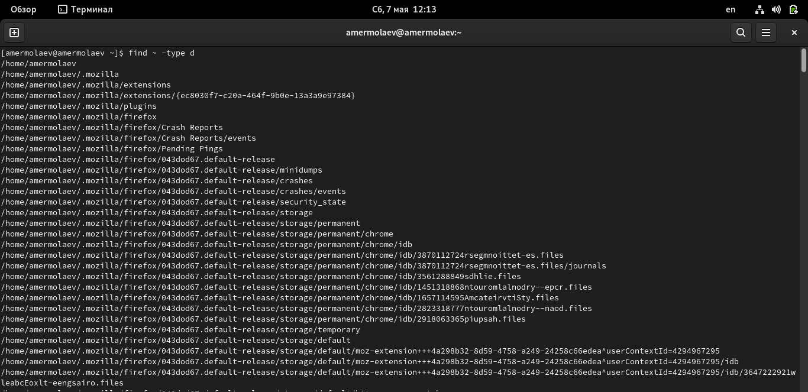

# **Отчет к лабораторной работе №6**
## **Common information**
discipline: Операционные системы  
group: НПМбд-01-21  
author: Ермолаев А.М.
---
---

## **Цель работы**
Ознакомление с инструментами поиска файлов и фильтрации текстовых данных.
Приобретение практических навыков: по управлению процессами (и заданиями), по
проверке использования диска и обслуживанию файловых систем.

## **Выполнение работы**
Выполним пункт 1, введя имя пароль.

Запишем в файл file.txt названия файлов, содержащихся в каталоге /etc. Псоле чего допишим в этот же файл названия файлов, содержащихся в вашем домашнем каталоге.



Выведем имена всех файлов из file.txt, имеющих расширение .conf, после чего запишим их в новый текстовой файл conf.txt.





Определим, какие файлы в вашем домашнем каталоге имеют имена, начинавшиеся с символа c? В данной ситуации могу предложить две реализации:





Выведем на экран (по странично) имена файлов из каталога /etc, начинающиеся с символа h.



Запустим в фоновом режиме процесс, который будет записывать в файл ~/logfile файлы, имена которых начинаются с log. После чего удалим файл ~/logfile.



Запустим из консоли в фоновом режиме редактор gedit. Определим идентификатор процесса gedit, используя команду ps, конвейер и фильтр grep. После чего прочтем справку (man) команды kill и завершим процесс gedit.



Выполним команды df и du, предварительно получив более подробную информацию об этих командах с помощью команды man.



Воспользовавшись справкой команды find, выведем имена всех директорий, имеющихся домашнем каталоге.



## **Ответы на контрольные вопросы**
### **Вопрос 1**
В системе по умолчанию открыто три специальных потока:
- stdin — стандартный поток ввода (по умолчанию: клавиатура), файловый дескриптор - 0;
- stdout — стандартный поток вывода (по умолчанию: консоль), файловый дескриптор 1;
- stderr — стандартный поток вывод сообщений об ошибках (по умолчанию: консоль), файловый дескриптор 2.
### **Вопрос 2**
Символ ```>```  перезаписывает существующий файл или создает файл, если файл с указанным именем отсутствует в каталоге.

Символ ```>>``` добавляет информацию в существующий файл или создает файл, если файл с указанным именем отсутствует в каталоге.
### **Вопрос 3**
Конвейер (pipe) служит для объединения простых команд или утилит в цепочки, в которых результат работы предыдущей команды передаётся последующей.
### **Вопрос 4**
Главное отличие между программой и процессом заключается в том, что программа - это набор инструкций, который позволяет ЦПУ выполнять определенную задачу, в то время как процесс - это исполняемая программа.
### **Вопрос 5**
PID - идентификатор процесса.  
GID - идентификатор группы UNIX, под которым работает программа.
### **Вопрос 6**
Запущенные фоном программы называются задачами (jobs). Ими можно управлять с помощью команды jobs, которая выводит список запущенных в данный момент задач.
### **Вопрос 7**
Команда htop похожа на команду top по выполняемой функции: они обе показывают информацию о процессах в реальном времени, выводят данные о потреблении системных ресурсов и позволяют искать, останавливать и управлять процессами.

У обеих команд есть свои преимущества. Например, в программе htop реализован очень удобный поиск по процессам, а также их фильтрация. В команде top это не так удобно — нужно знать кнопку для вывода функции поиска.

Зато в top можно разделять область окна и выводить информацию о процессах в соответствии с разными настройками. В целом top намного более гибкая в настройке отображения процессов.

### **Вопрос 8**
Команда find используется для поиска и отображения на экран имён файлов, соответствующих заданной строке символов.

```find путь [-опции]```

При записи команды ```find ~ -name "f*" -print``` выведятся на экран имена файлов из вашего домашнего каталога и его подкаталогов, начинающихся на f.
### **Вопрос 9**
Найти файл по контексту (содержанию) можно, воспользовавщись командой  
```ls -l | grep <шаблон>```
### **Вопрос 10**
Команда df показывает размер каждого смонтированного раздела диска.
### **Вопрос 11**
Команда du показывает число килобайт, используемое каждым файлом или каталогом.

```du ~/```
### **Вопрос 12**
Для завершения задачи необходимо выполнить команду   
``` kill <номер задачи>```

## **Вывод**
В рамках выполнения работы я ознакомился с инструментами поиска файлов и фильтрации текстовых данных и приобрел практический навык по управлению процессами (и заданиями) и по
проверке использования диска и обслуживанию файловых систем.
