---
## Front matter
lang: ru-RU
title: Презентация к лабораторной работе №7
author: Ермолаев А.М.
group: НПМбд-01-21

## Formatting
toc: false
slide_level: 2
theme: metropolis
header-includes: 
 - \metroset{progressbar=frametitle,sectionpage=progressbar,numbering=fraction}
 - '\makeatletter'
 - '\beamer@ignorenonframefalse'
 - '\makeatother'
aspectratio: 43
section-titles: true
---

# Презентация к лабораторной работе №7

# Цель работы

Освоение основных возможностей командной оболочки Midnight Commander. Приобретение навыков практической работы по просмотру каталогов и файлов; манипуляций
с ними.

# Выполнение работы

## Информация о mc

## Изучение меню mc

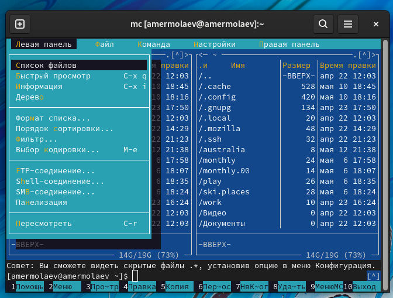

## Операции mc, связвнные с управляющими клавишами

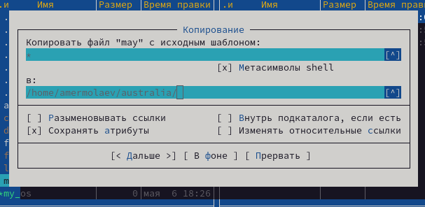

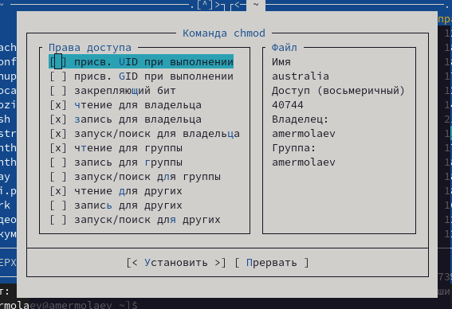

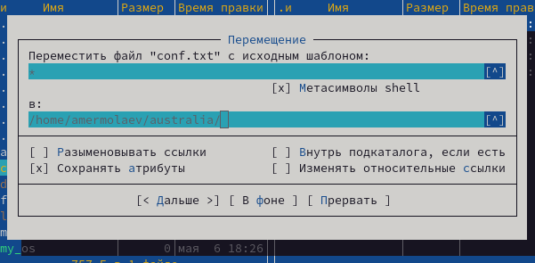

## Основные команды панелей

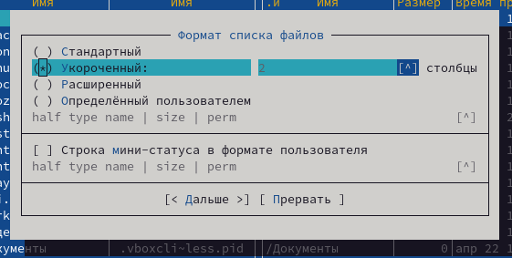

## Работа с подменю "Файл"

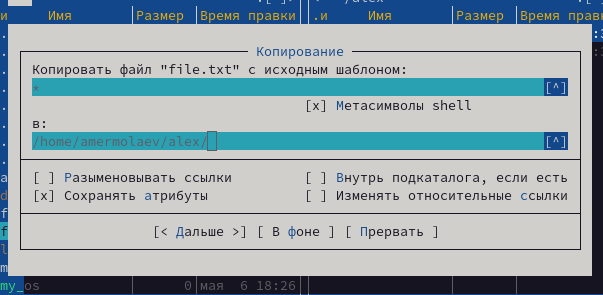

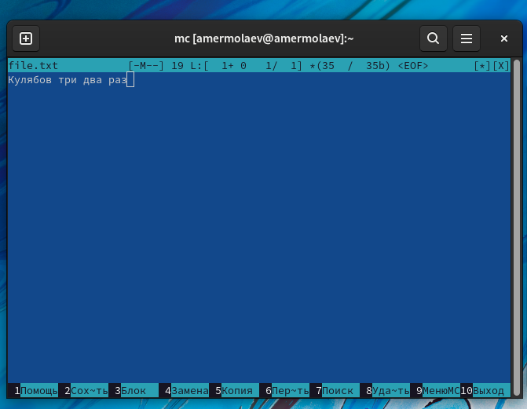

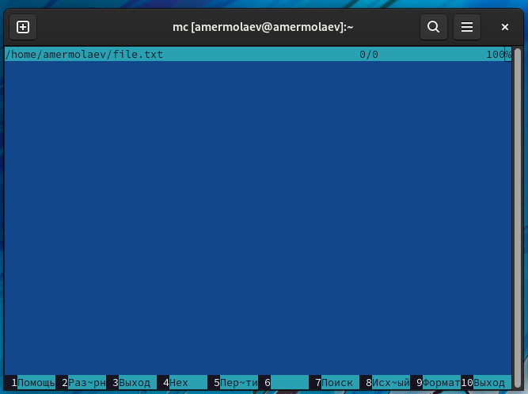

## Работа с подменю "Команда"

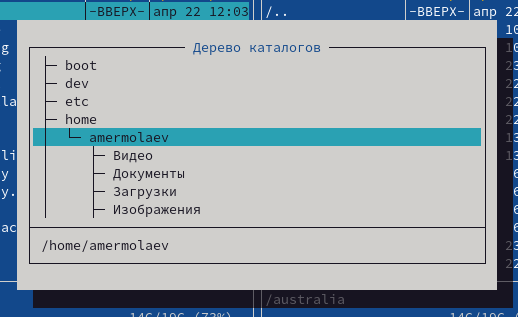

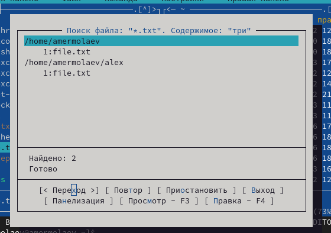

## Работа с подменю "Настройки"

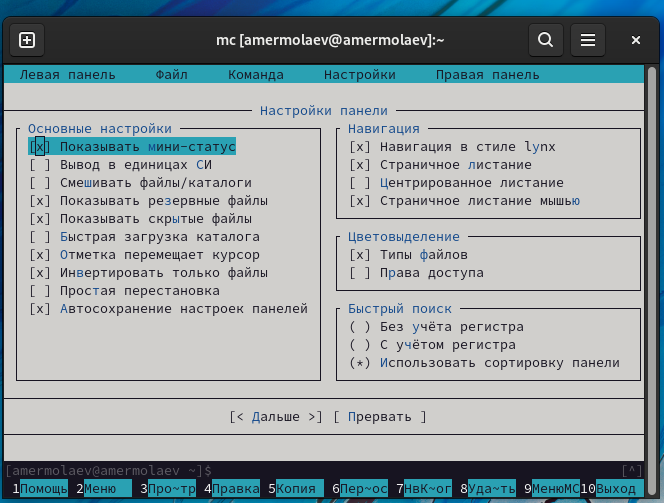

## Создание и работа с файлом

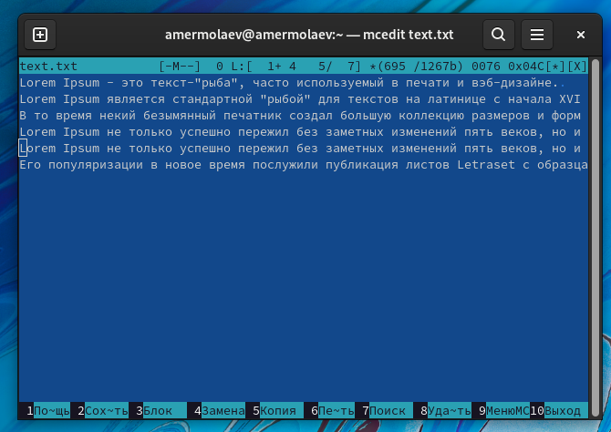

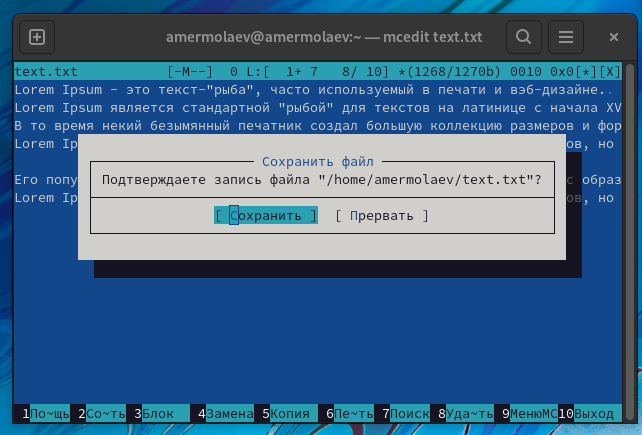

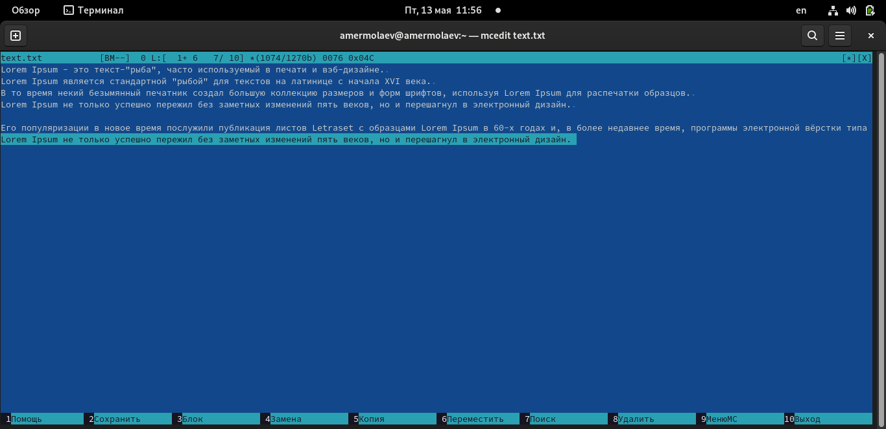

## Работа со скриптом

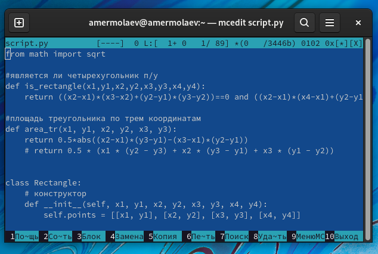

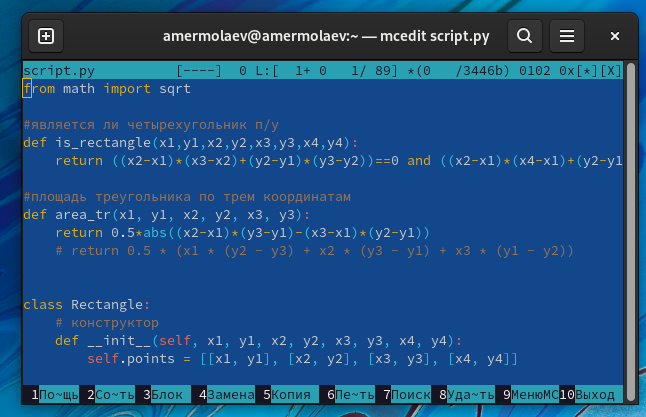

# Вывод
## В рамках выполнения работы я освоил основные возможности командной оболочки Midnight Commander, а также приобрел навык практической работы по просмотру каталогов и файлов и манипуляций с ними.

# Финал
