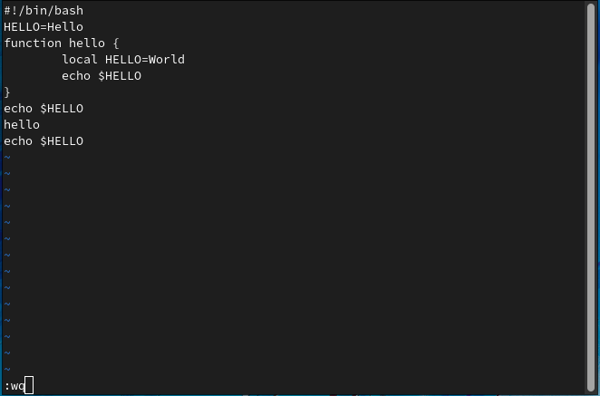

---
## Front matter
lang: ru-RU
title: Презентация к лабораторной работе №8
author: Ермолаев А.М.
group: НПМбд-01-21

## Formatting
toc: false
slide_level: 2
theme: metropolis
header-includes: 
 - \metroset{progressbar=frametitle,sectionpage=progressbar,numbering=fraction}
 - '\makeatletter'
 - '\beamer@ignorenonframefalse'
 - '\makeatother'
aspectratio: 43
section-titles: true
---

# Презентация к лабораторной работе №8

# Цель работы

Познакомиться с операционной системой Linux. Получить практические навыки работы с редактором vi, установленным по умолчанию практически во всех дистрибутивах.

# Выполнение работы

## Создание нового файла с использованием vi

## Редактирование существующего файла 

 

# Вывод
## В рамках выполнения работы я познакомился с операционной системой Linux и получил практические навыки работы с редактором vi, установленным по умолчанию практически во всех дистрибутивах.

# Финал
