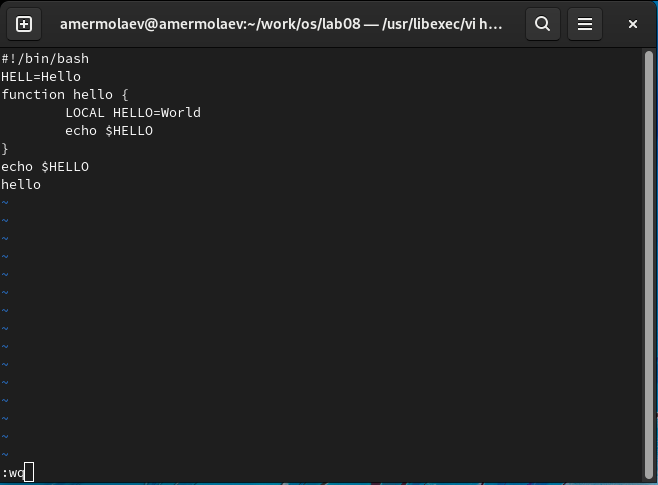
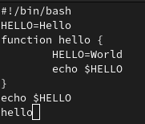
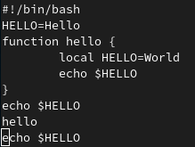
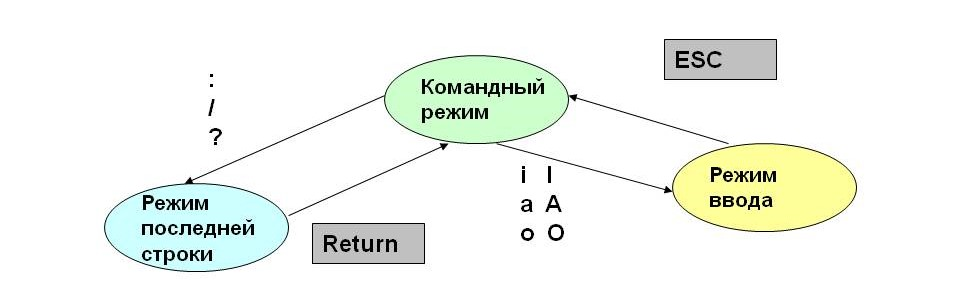

# **Отчет к лабораторной работе №8**
## **Common information**
discipline: Операционные системы  
group: НПМбд-01-21  
author: Ермолаев А.М.
---
---


## **Цель работы**

Познакомиться с операционной системой Linux. Получить практические навыки работы с редактором vi, установленным по умолчанию практически во всех дистрибутивах.

## **Выполнение работы**
Выполним задание 1.

Создадим каталог с именем ~/work/os/lab08 перейдем в него.


Вызовем vi и создайте файл hello.sh командой ```vi hello.sh```

Нажмем клавишу i и введем предложенный текст. После нажмем клавишы Esc для перехода в командный режим, : для перехода в режим последней строки и w (записать) и q (выйти), а затем е клавишу Enter для сохранения вашего текста и завершения работы.



Сделайте файл исполняемым командой ```chmod +x hello.sh```

Выполним задание 2.

Вызовем vi на редактирование файла командой ```vi ~/work/os/lab08/hello.sh```

Установим курсор в конец слова HELL второй строки.
  


Перейдем в режим вставки и замените на HELLO, а затем нажмем Esc для возврата в командный режим.
  


Установим курсор на четвертую строку и сотрите слово LOCAL.




Перейдем в режим вставки и наберем следующий текст: local, а затем нажмите Esc для возврата в командный режим.


Установим курсор на последней строке файла. Вставим после неё строку, содержащую следующий текст: echo $HELLO.


Нажмем Esc для перехода в командный режим, а после удалим последнюю строку.


Введем команду отмены изменений u для отмены последней команды.  



Введем символ : для перехода в режим последней строки. Запишем произведённые изменения и выйдите из vi.


## **Ответы на контрольные вопросы**
### *Вопрос 1*
Редактор vi имеет три режима работы:
- командный режим − предназначен для ввода команд редактирования и навигации по редактируемому файлу;
- режим вставки − предназначен для ввода содержания редактируемого файла;
- режим последней (или командной) строки − используется для записи изменений в файл и выхода из редактора.

### *Вопрос 2*
Чтобы выйти из редактора, не сохраняя произведённые изменения, нужно в режиме командной строки нажать клавиши «:» + «q» + «!»

### *Вопрос 3*
Команды позиционирования:
- «0»(ноль) − переход в начало строки;
- «$» − переход в конец строки;
- «G» − переход в конец файла;
- n«G» − переход на строку с номером n.

### *Вопрос 4*
При использовании прописных W и B под разделителями понимаются только пробел, табуляция и возврат каретки. При использовании строчных w и b под разделителями понимаются также любые знаки пунктуации.

### *Вопрос 5*
Чтобы из любого места редактируемого файла перейти в начало (конец) файла, нужно в режиме командной строки нажать клавиши «1» + «G» + («G»).

### *Вопрос 6*
Команды редактирования:

Вставка текста 
- «а» − вставить текст после курсора;
- «А» − вставить текст в конец строки;
- «i» − вставить текст перед курсором;
- n «i» − вставить текст n раз;
- «I» − вставить текст в начало строки.

Вставка строки 
- «о» − вставить строку под курсором;
- «О» − вставить строку над курсором.

Удаление текста
- «x» − удалить один символ в буфер;
- «d» «w» − удалить одно слово в буфер;
- «d» «$» − удалить в буфер текст от курсора до конца строки;
- «d» «0» − удалить в буфер текст от начала строки до позиции курсора;
- «d» «d» − удалить в буфер одну строку;
- n «d» «d» − удалить в буфер n строк.

Отмена и повтор произведённых изменений
- «u» − отменить последнее изменение;
- «.» − повторить последнее изменение.

Копирование текста в буфер 
- «Y» − скопировать строку в буфер;
- n «Y» − скопировать n строк в буфер;
- «y» «w» − скопировать слово в буфер.

Вставка текста из буфера 
- «p» − вставить текст из буфера после курсора;
- «P» − вставить текст из буфера перед курсором.

Замена текста 
- «c» «w» − заменить слово;
- n «c» «w» − заменить nслов;
- «c» «$» − заменить текст от курсора до конца строки;
- «r» − заменить слово;
- «R» − заменить текст.

Поиск текста 
- «/» текст − произвести поиск вперёд по тексту указанной строки символов текст;
- «?» текст − произвести поиск назад по тексту указанной строки символов текст.

Копирование и перемещение текста 
- «:» n,m «d» – удалить строки с n по m;
- «:» i,j «m» k – переместить строки с i по j, начиная со строки k;
- «:» i,j «t» k – копировать строки с i по j в строку k;
- «:» i,j «w» имя-файла – записать строки с i по j в файл с именем имя-файла.

### *Вопрос 7*
Чтобы заполнить строку символами $, необходимо для начала перейти на эту строку, нажав клавиши n «G», где n – номер строки, далее нажать «0» для перехода в начало строки. Теперь необходимо нажать «c» «$», чтобы заменить текст от курсора до конца строки, и ввести символы $.

 ### *Вопрос 8*
Чтобы отменить по одному предыдущему действию последовательно, необходимо нажать «u». Чтобы отменить все изменения, произведённые со времени последней записи, нужно нажать «:» + «e» + «!».

### *Вопрос 9*
Команды редактирования в режиме командной строки

Копирование и перемещение текста 
- «:»n,m «d» − удалить строки с n по m;
- «:»i,j «m» k − переместить строки с i по j, начиная со строки k;
- «:»i,j «t» k − копировать строки с i по j в строку k;
- «:»i,j «w» имя-файла − записать строки с i по j в файл с именем имя-файла.

Запись в файл и выход из редактора 
- «:» «w» − записать изменённый текст в файл, не выходя из vi;
- «:» «w» имя-файла − записать изменённый текст в новый файл с именем имя-файла;
- «:» «w» «!» имя-файла − записать изменённый текст в файл с именем имя-файла;
- «:» «w» «q» − записать изменения в файл и выйти из vi;
- «:» «q» − выйти из редактора vi;
- «:» «q» «!» − выйти из редактора без записи;
- «:» «e» «!» − вернуться в командный режим, отменив все изменения, произведённые со времени последней записи.

Опции редактора vi позволяют настроить рабочую среду. Для задания опций используется команда set (в режиме последней строки):

- «:»set all − вывести полный список опций;
- «:»set nu − вывести номера строк;
- «:»set list − вывести невидимые символы;
- «:»set ic − не учитывать при поиске, является ли символ прописным или строчным.

Если вы хотите отказаться от использования опции, то в команде set перед именем опции надо поставить no.

### *Вопрос 10*
Чтобы определить, не перемещая курсора, позицию, в которой заканчивается строка, нужно в командном режиме находясь на нужной строке нажать «$»и посмотреть на число после запятой в правом нижнем углу экрана.

### *Вопрос 11*
Опции редактора vi позволяют настроить рабочую среду. Для задания опций используется команда set (в режиме командной строки). Если вы хотите отказаться от использования опции, то в команде set перед именем опции надо поставить no. Чтобы просмотреть опции редактора vi, необходимо нажать «:» set all. Нажав «:» help “название_опции”, можно узнать назначение конкретной опции.

### *Вопрос 12*
В режиме командной строки внизу редактора присутствует «:», в режиме ввода – «--ВСТАВКА --», в командном режиме внизу ничего нет.

### *Вопрос 13*


## **Вывод**
В рамках выполнения работы я познакомился с операционной системой Linux и получил практические навыки работы с редактором vi, установленным по умолчанию практически во всех дистрибутивах.