# **Отчет к лабораторной работе №9**
## **Common information**
discipline: Операционные системы  
group: НПМбд-01-21  
author: Ермолаев А.М.


## **Цель работы**
Познакомиться с операционной системой Linux. Получить практические навыки работы с редактором Emacs.


## **Выполнение работы**

Откроем emacs и создадим файл lab09.sh с помощью комбинации Ctrl-x Ctrl-f. Наберем предложенный текст.

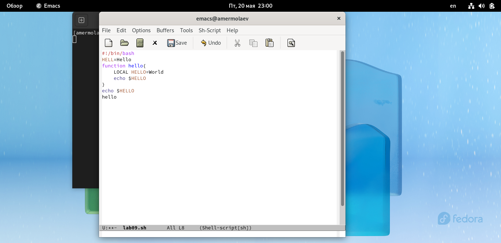

Сохраниv файл с помощью комбинации Ctrl-x Ctrl-s.


Проделаем с текстом стандартные процедуры редактирования, каждое действие должно осуществляться комбинацией клавиш.
- Вырежем одной командой целую строку (С-k).
- Вставим эту строку в конец файла (C-y).
- Выделим область текста (C-space).
- Скопируем область в буфер обмена (M-w).
- Вставим область в конец файла.
- Вновь выделим эту область и на этот раз вырезать её (C-w).
- Отменим последнее действие (C-/).

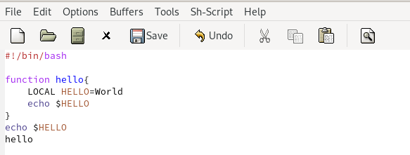

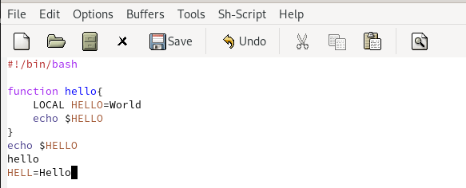

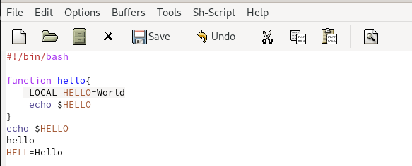

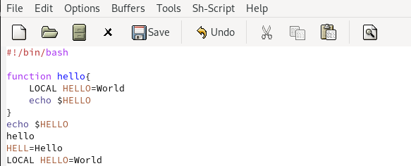

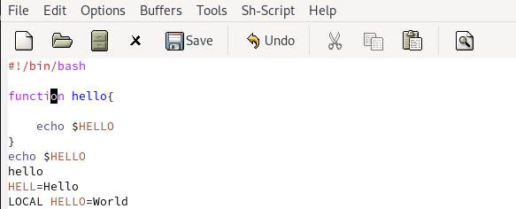

Научимся использовать команды по перемещению курсора.
- Переместим курсор в начало строки (C-a).
- Переместим курсор в конец строки (C-e).
- Переместим курсор в начало буфера (M-<).
- Переместим курсор в конец буфера (M->).

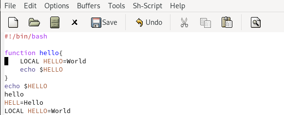


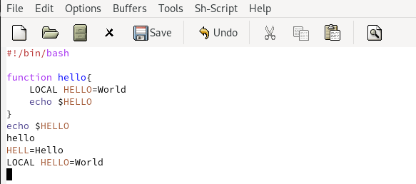

Ознакомимся с управлением буферами.
- Выведем список активных буферов на экран (C-x C-b).
- Переместимся во вновь открытое окно (C-x) o со списком открытых буферов и переключимся на другой буфер.
- Закроем это окно (C-x 0).
- Вновь переключимся между буферами, но уже без вывода их списка на экран (C-x b).
  
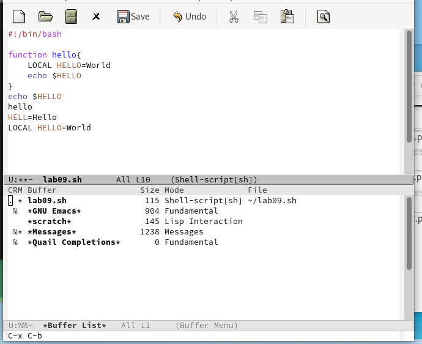

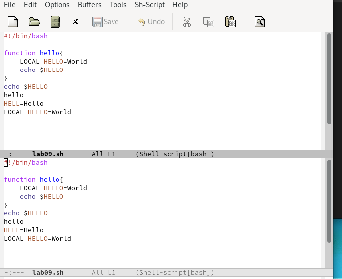

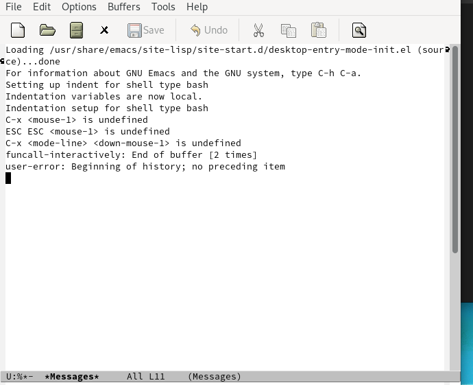

Ознакомимся с управлением окнами.
- Поделим фрейм на 4 части: разделим фрейм на два окна по вертикали (C-x 3), а затем каждое из этих окон на две части по горизонтали (C-x 2).
- В каждом из четырёх созданных окон откроем новый буфер (файл) и введем несколько строк текста.

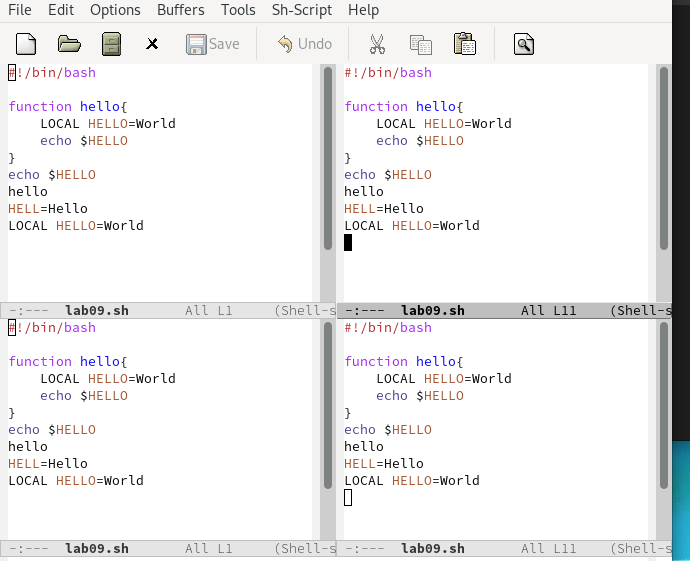

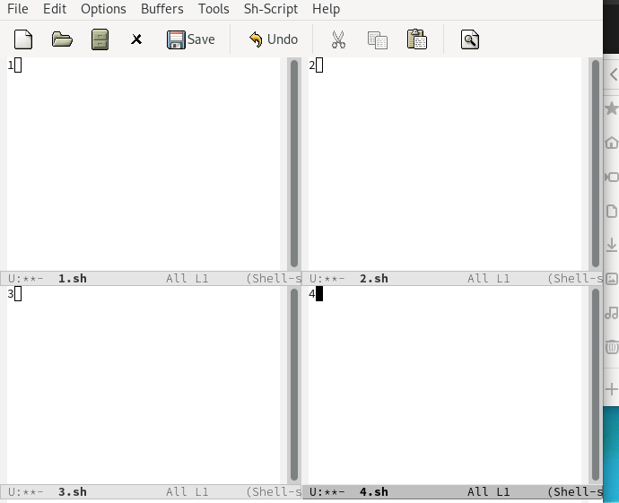

Перейдем в режим поиска
- Переключимся в режим поиска (C-s) и найдем несколько слов, присутствующих в тексте.
- Переключимся между результатами поиска, нажимая C-s.
- Выйдем из режима поиска, нажав C-g.
- Перейдем в режим поиска и замены (M-%), введем текст, который следует найти
и заменить, нажмем Enter , затем введем текст для замены. После того как будут
подсвечены результаты поиска, нажмем ! для подтверждения замены.
- Испробуем другой режим поиска, нажав M-s o.

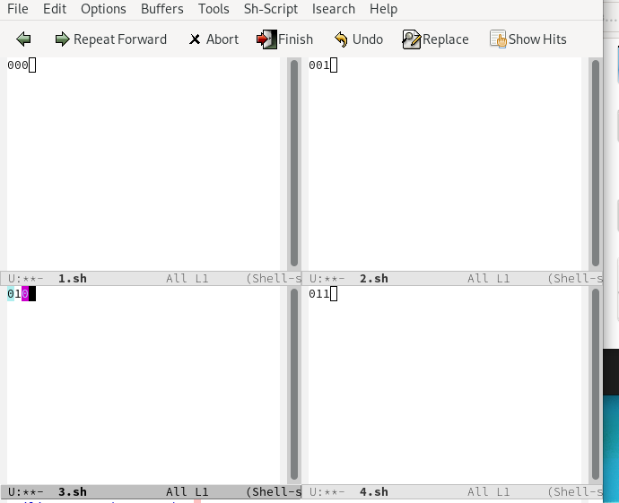

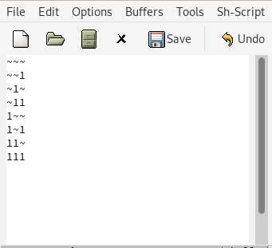

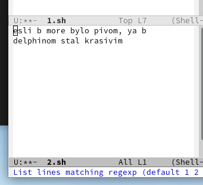


## **Ответы на контрольные вопросы**
### *Вопрос 1*
Emacs — один из наиболее мощных и широко распространённых редакторов, используемых в мире UNIX. По популярности он соперничает с редактором vi и его клонами.
В зависимости от ситуации, Emacs может быть:
- текстовым редактором;
- программой для чтения почты и новостей Usenet;
- интегрированной средой разработки (IDE);
- операционной системой;
- всем, чем угодно.

Всё это разнообразие достигается благодаря архитектуре Emacs, которая позволяет расширять возможности редактора при помощи языка Emacs Lisp. На языке C написаны лишь самые базовые и низкоуровневые части Emacs, включая полнофункциональный интерпретатор языка Lisp. Таким образом, Emacs имеет встроенный язык программирования, который может использоваться для настройки, расширения и изменения поведения редактора. В действительности, большая часть того редактора, с которым пользователи Emacs работают в наши дни, написана на языке Lisp.

Первая версия редактора Emacs была написана в 70-х годах 20-го столетия Richard Stallman (Ричардом Столманом) как набор макросов для редактора TECO . В дальнейшем, уже будучи основателем Фонда Свободного программного обеспечения Free Software Foundation и проекта GNU, Stallman разработал GNU Emacs в развитие оригинального Emacs и до сих пор сопровождает эту программу. Вы можете подробнее ознакомиться с историей редактора, прочитав статью, располагающуюся по этому адресу.

Emacs является одним из старейших редакторов. Он использовался тысячами программистов на протяжении последних 20 с лишним лет, для него создано много дополнительных пакетов расширений. Эти дополнения позволяют делать с помощью Emacs такие вещи, которые Stallman , вероятно, даже не считал возможными в начале своей работы над редактором. Более подробно я расскажу о них в следующих разделах.

### *Вопрос 2*
Основная трудность при освоении данного редактора -  большое количество команд, комбинаций клавиш.

### *Вопрос 3*
Буфер — объект, представляющий какой-либо текст.
Буфер может содержать что угодно, например, результаты компиляции программы
или встроенные подсказки. Практически всё взаимодействие с пользователем, в том
числе интерактивное, происходит посредством буферов.

### *Вопрос 4*
Можно, но не стоит.

### *Вопрос 5*
При запуске Emacs по умолчанию создаются следующие буферы: 
- «scratch» (буфер для несохраненного текста) 
- «Messages»(журнал ошибок, включающий такжеинформацию, которая появляется в области EchoArea)
- «GNUEmacs»(справочный буфер о редакторе).

### *Вопрос 6*
```C-c |```

Удерживая «ctrl»,нажимаю «c»,после чего отпускаю обе клавишии нажимаю «|»

```C-c C-|``` 

Удерживая «ctrl»,нажимаю «с», после чего отпускаю обе клавиши и, удерживая «ctrl», нажимаю «|».

### *Вопрос 7*
Чтобы поделить окно на две части необходимо воспользоваться комбинацией «Ctrl-x 3»(по вертикали) или «Ctrl-x 2» (по горизонтали).

### *Вопрос 8*
Настройки Emacs хранятся в файле .emacs.

### *Вопрос 9*
По умолчанию клавиша «←» удаляет символ перед курсором, но в редакторе её можно переназначить. Для этого необхдимо изменить конфигурацию файла .emacs.

### *Вопрос 10*
Emacs в моем понимании более удобен.

1) Одновременная работа с множеством файлов
2) Подсветка синтаксиса
3) Многозадачность

## **Вывод**
В рамках выполнения работы я познакомился с операционной системой Linux и получил практические навыки работы с редактором Emacs.