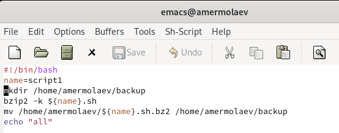
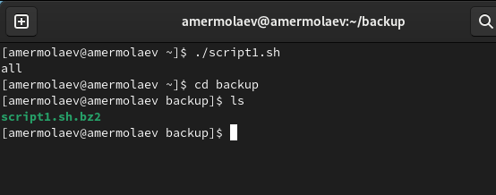
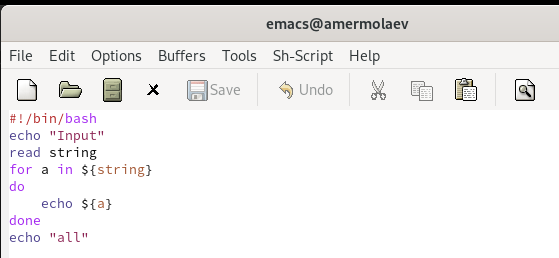
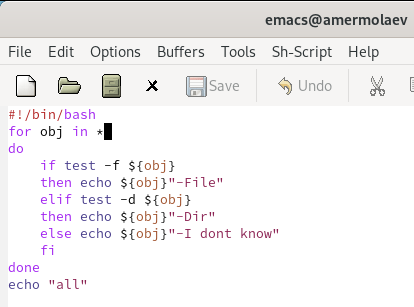
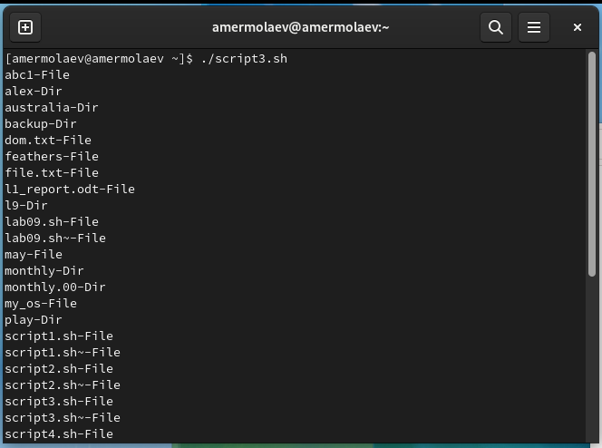

---
## Front matter
lang: ru-RU
title: Презентация к лабораторной работе №10
author: Ермолаев А.М.
group: НПМбд-01-21

## Formatting
toc: false
slide_level: 2
theme: metropolis
header-includes: 
 - \metroset{progressbar=frametitle,sectionpage=progressbar,numbering=fraction}
 - '\makeatletter'
 - '\beamer@ignorenonframefalse'
 - '\makeatother'
aspectratio: 43
section-titles: true
---

# Презентация к лабораторной работе №10

# Цель работы

Изучить основы программирования в оболочке ОС UNIX/Linux. Научиться писать небольшие командные файлы.

# Выполнение работы

## Первый скрипт

## Второй скрипт

## Третий скрипт

## Четвертый скрипт 

# Вывод
## В рамках выполнения работы я изучил основы программирования в оболочке ОС UNIX/Linux и научился писать небольшие командные файлы.

# Финал
