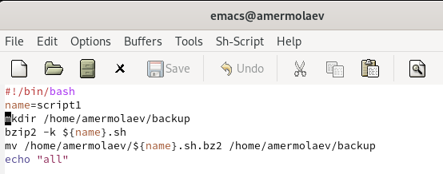
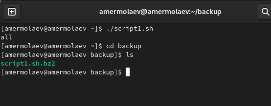
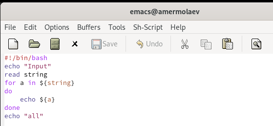
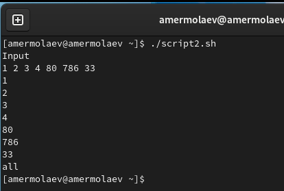
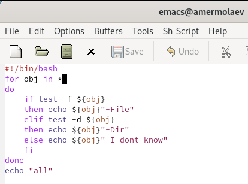
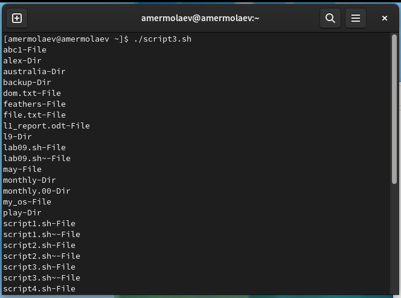
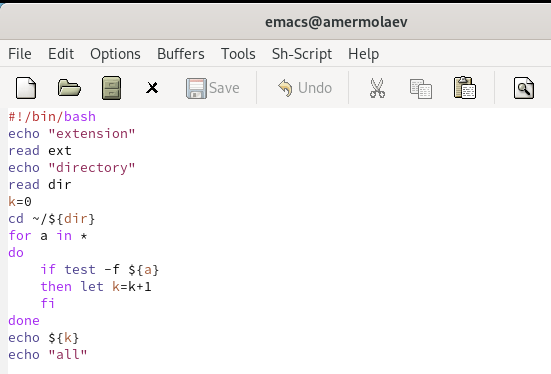
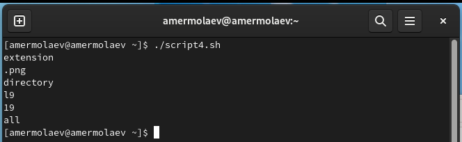

# **Отчет к лабораторной работе №10**
## **Common information**
discipline: Операционные системы  
group: НПМбд-01-21  
author: Ермолаев А.М.


## **Цель работы**
Изучить основы программирования в оболочке ОС UNIX/Linux. Научиться писать небольшие командные файлы.


## **Выполнение работы**
Напишем скрипт, который при запуске будет делать резервную копию самого себя (то есть файла, в котором содержится его исходный код) в другую директорию backup
в вашем домашнем каталоге. При этом файл должен архивироваться одним из архиваторов на выбор zip, bzip2 или tar. Способ использования команд архивации узнаем, изучив справку команды man.



Дадим файлу право на исполнение при помщи команды(это мы будем делать для всех четырех файлов).

```
chmod +x script1.sh
```

Запустим файл.



Напишем пример командного файла, обрабатывающего любое произвольное число аргументов командной строки, в том числе превышающее десять. Наш скрипт будет последовательно распечатывать значения всех переданных аргументов.



Запустим файл.



Напишем командный файл — аналог команды ls (без использования самой этой команды и команды dir). Требуется, чтобы он выдавал информацию о нужном каталоге и выводил информацию о возможностях доступа к файлам этого каталога.



Запустим файл.



Напишем командный файл, который получает в качестве аргумента командной строки формат файла (.txt, .doc, .jpg, .pdf и т.д.) и вычисляет количество таких файлов в указанной директории. Путь к директории также передаётся в виде аргумента командной строки.



Запустим файл.



## **Ответы на контрольные вопросы**

### *Вопрос 1*
Командный процессор (командная оболочка, интерпретатор команд shell) − это программа, позволяющая пользователю взаимодействовать с операционной системой компьютера. В операционных системах типа UNIX/Linux наиболее часто используются следующие реализации командных оболочек:

- оболочка Борна (Bourneshellили sh) − стандартная командная оболочка UNIX/Linux, содержащая базовый, но при этом полный набор функций; 
- С-оболочка (или csh) −надстройка на оболочкой Борна, использующая Сподобный синтаксис команд с возможностью сохранения истории выполнения команд; 
- Оболочка Корна (или ksh) − напоминает оболочку С, но операторы управления программой совместимы с операторами оболочки Борна; 
- BASH − сокращение от BourneAgainShell(опять оболочка Борна), в основе своей совмещает свойства оболочек С и Корна (разработка компании FreeSoftwareFoundation). 

### *Вопрос 2*
2). POSIX (Portable Operating System Interface for Computer Environments ) − набор стандартов описания интерфейсов взаимодействия операционной системы и прикладных программ. Стандарты POSIX разработаны комитетом IEEE (Institute of Electricaland Electronics Engineers) для обеспечения совместимости различных UNIX/Linux подобных операционных систем и переносимости прикладных программ на уровне исходного кода. POSIX - совместимые оболочки разработаны на базе оболочки Корна.

### *Вопрос 3*
Командный процессор bash обеспечивает возможность использования переменных типа строка символов. Имена переменных могут быть выбраны пользователем. Пользователь имеет возможность присвоить переменной значение некоторой строки символов. Значение, присвоенное некоторой переменной, может быть впоследствии использовано. Для этого в соответствующем месте командной строки должно быть употреблено
имя этой переменной, которому предшествует метасимвол $.

Оболочка bash позволяет работать с массивами. Для создания массива используется
команда set с флагом -A. За флагом следует имя переменной, а затем список значений,
разделённых пробелами.

### *Вопрос 4*
Команда let берет два операнда и присваивает их переменной.

Команда read позволяет читать значения переменных со стандартного ввода.

### *Вопрос 5*
В языке программирования bash можно применять такие арифметические операции как сложение (+), вычитание (-), умножение (*), целочисленное деление (/) и целочисленный остаток от деления (%).

### *Вопрос 6*
В (( ))можно записывать условия оболочки bash, а также внутри двойных скобок можно вычислять арифметические выражения и возвращать результат.

### *Вопрос 7*
Стандартные переменные:
- PATH: значением данной переменной является список каталогов, в которых командный процессор осуществляет поиск программы или команды, указанной в командной строке, в том случае, если указанное имя программы или команды не содержит ни одного символа /. Если имя команды содержит хотя бы один символ /, то последовательность поиска, предписываемая значением переменной PATH, нарушается. В этом случае в зависимости от того, является имя команды абсолютным или относительным, поиск начинается соответственно от корневогоили текущего каталога.
- PS1 и PS2: эти переменные предназначены для отображения промптера командного процессора. PS1 − это промптер командного процессора, по умолчанию его значение равно символу $ или #. Если какая-то интерактивная программа, запущенная командным процессором, требует ввода, то используется промптер PS2. Он по умолчанию имеет значение символа >.
- HOME: имя домашнего каталога пользователя. Если команда cdвводится без аргументов, то происходит переход в каталог,указанный в этой переменной.
- IFS:последовательность символов, являющихся разделителями в командной строке, например, пробел, табуляция и перевод строки (newline).
- MAIL:командный процессор каждый раз перед выводом на экран промптера проверяет содержимое файла, имя которого указано в этой переменной, и если содержимое этого файла изменилось с момента последнего ввода из него, то перед тем как вывести на терминал промптер, командный процессор выводит на терминал сообщение Youhavemail(у Вас есть почта).
- TERM: тип используемого терминала.
- LOGNAME: содержит регистрационное имя пользователя, которое устанавливается автоматически при входе в систему.

### *Вопрос 8*
Такие символы, как ' < > * ? | " &, являются метасимволами и имеют для командного процессора специальный смысл.

### *Вопрос 9*
Снятие специального смысла с метасимвола называется экранированием мета символа. Экранирование может быть осуществлено с помощью предшествующего мета символу символа , который, в свою очередь, является мета символом. Для экранирования группы метасимволов нужно заключить её в одинарные кавычки. Строка, заключённая в двойные кавычки, экранирует все метасимволы, кроме $, ' , , ".

### *Вопрос 10*
Последовательность команд может быть помещена в текстовый файл. Такой файл называется командным. Далее этот файл можно выполнить по команде:

```bash командный_файл [аргументы]```

Чтобы не вводить каждый раз последовательности символов bash, необходимо изменить код защиты этого командного файла, обеспечив доступ к этому файлу по выполнению. Это может быть сделано с помощью команды

```chmod +x имя_файла```

Теперь можно вызывать свой командный файл на выполнение, просто вводя его имя с терминала так, как будтоон является выполняемой программой. Командный процессор распознает, что в Вашем файле на самом деле хранится не выполняемая программа, а программа, написанная на языке программирования оболочки, и осуществить её интерпретацию.

### *Вопрос 11*
Группу команд можно объединить в функцию. Для этого существует ключевое слово
function, после которого следует имя функции и список команд, заключённых в фигурные скобки. Удалить функцию можно с помощью команды unset c флагом -f.

### *Вопрос 12*
Чтобы выяснить, является ли файл каталогом или обычным файлом, необходимо воспользоваться командами ```test-f [путь до файла]``` (для проверки, является ли обычным файлом) и ```test -d[путь до файла]``` (для проверки, является ли каталогом).
### *Вопрос 13*
Команду «set» можно использовать для вывода списка переменных окружения. В системах Ubuntu и Debia nкоманда «set» также выведет список функций командной оболочки после списка переменных командной оболочки. Поэтому для ознакомления со всеми элементами списка переменных окружения при работе с данными системами рекомендуется использовать команду «set| more». Команда «typeset» предназначена для наложения ограничений на переменные. Команду «unset» следует использовать для удаления переменной из окружения командной оболочки.

### *Вопрос 14*
 При вызове командного файла на выполнение параметры ему могут быть переданы точно таким же образом, как и выполняемой программе. С точки зрения командного файла эти параметры являются позиционными. Символ $ является метасимволом командного процессора. Он используется, в частности, для ссылки на параметры, точнее, для получения их значений в командном файле. В командный файл можно передать до девяти параметров. При использовании где-либо в командном файле комбинации символов $i, где 0 < i< 10, вместо неё будет осуществлена подстановка значения параметра с порядковым номером i, т.е. аргумента командного файла с порядковым номером i. Использование комбинации символов $0 приводит к подстановке вместо неё имени данного командного файла.

### *Вопрос 15*
- $* −отображается вся командная строка или параметры оболочки;
- $? −код завершения последней выполненной команды; 
- $$ −уникальный идентификатор процесса, в рамках которого выполняется командный процессор; 
- $! −номер процесса, в рамках которого выполняется последняя вызванная на выполнение в командном режиме команда; 
- $-−значение флагов командного процессора; 
- {#} −возвращает целое число −количествослов, которые были результатом; 
- ${#name} −возвращает целое значение длины строки в переменной name; 
- ${name[n]} −обращение к n-му элементу массива; 
- ${name[]}−перечисляет все элементы массива, разделённые пробелом; 
- ${name[@]}−то же самое, но позволяет учитывать символы пробелы в самих переменных; 
- ${name:-value} −если значение переменной name не определено, то оно будет заменено на указанное value; 
- ${name:value} −проверяется факт существования переменной; ${name=value} −если name не определено, то ему присваивается значение value; 
- ${name?value} −останавливает выполнение, если имя переменной не определено, и выводит value как сообщение об ошибке; 
- ${name+value} −это выражение работает противоположно ${name-value}. Если переменная определена, то подставляется value; 

## **Вывод**
В рамках выполнения работы я изучил основы программирования в оболочке ОС UNIX/Linux и научился писать небольшие командные файлы.
