# **Отчет к лабораторной работе №11**
## **Common information**
discipline: Операционные системы  
group: НПМбд-01-21  
author: Ермолаев А.М.
---


## **Цель работы**
Изучить основы программирования в оболочке ОС UNIX. Научится писать более сложные командные файлы с использованием логических управляющих конструкций и циклов.

## **Выполнение работы**
Используя команды getopts  и grep, напишем командный файл, который анализирует командную строку с ключами:
- -i inputfile — прочитать данные из указанного файла;
- -o outputfile — вывести данные в указанный файл;
- -p шаблон — указать шаблон для поиска;
- -C — различать большие и малые буквы;
- -n — выдавать номера строк.

а затем ищет в указанном файле нужные строки, определяемые ключом -p.

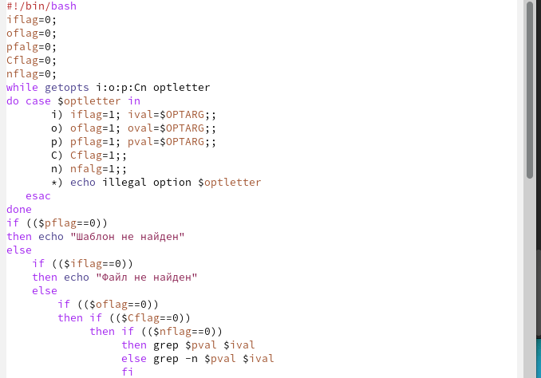

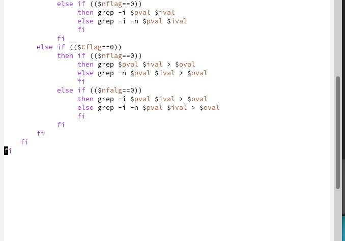

Проверим корректность написанного файла.

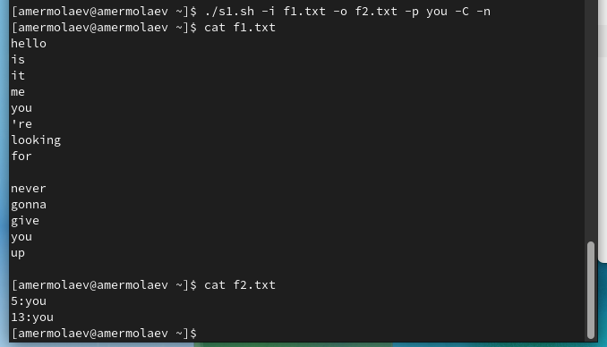

Напишем на языке Си программу, которая вводит число и определяет, является ли оно больше нуля, меньше нуля или равно нулю. Затем программа завершается с помощью функции exit(n), передавая информацию в о коде завершения в оболочку. Командный файл должен вызывать эту программу и, проанализировав с помощью команды $?, выдать сообщение о том, какое число было введено.

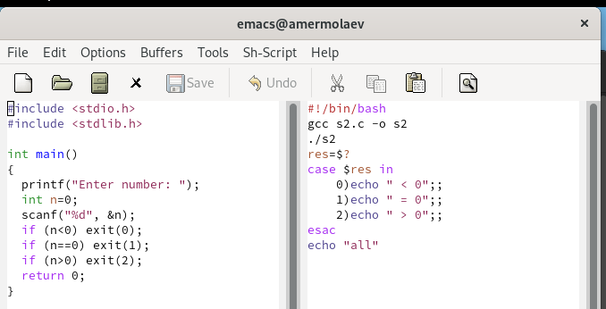

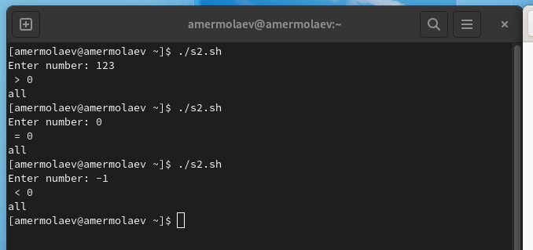

Для сравнения данное задание можно выполнить при помощи языка C++.

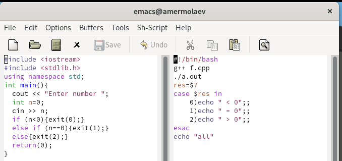

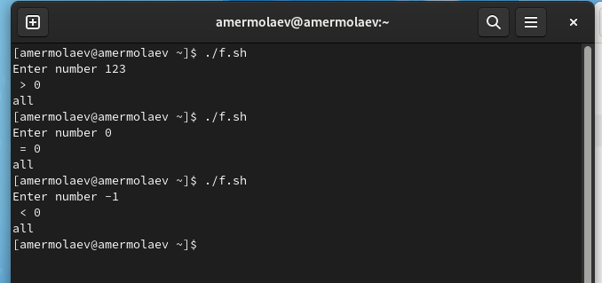


Напишем командный файл, создающий указанное число файлов, пронумерованных последовательно от 1 до 𝑁 (например 1.tmp, 2.tmp, 3.tmp,4.tmp и т.д.). Число файлов, которые необходимо создать, передаётся в аргументы командной строки. Этот же командный файл должен уметь удалять все созданные им файлы (если они существуют).

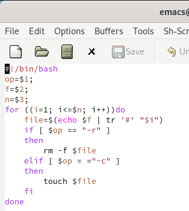

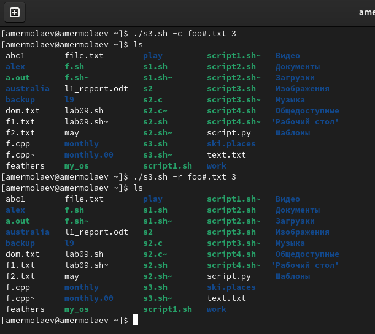

Напишем командный файл, который с помощью команды tar запаковывает в архив все файлы в указанной директории. Модифицируем его так, чтобы запаковывались только те файлы, которые были изменены менее недели тому назад (использовать команду find).

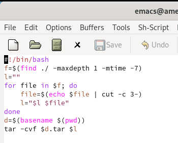

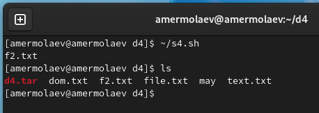

## **Ответы на контрольные вопросы**
### *Вопрос 1*
Getopts-это встроенная команда оболочки Unix для анализа аргументов командной строки. Она предназначен для обработки аргументов командной строки, которые следуют рекомендациям синтаксиса утилиты POSIX, основанным на интерфейсе C getopt.

### *Вопрос 2*
При перечислении имён файлов текущего каталога можно использовать следующие символы:
- ```*``` −соответствует произвольной, в том числе и пустой строке; 
- ?−соответствует любому одинарному символу; 
- [c1-c2] − соответствует любому символу, лексикографически находящемуся между символами с1 и с2. Например, 
    - 1.1 echo − выведет имена всех файлов текущего каталога, что представляет собой простейший аналог команды ls;
    -  1.2. ls*.c−выведет все файлы с последними двумя символами, совпадающими с.c. 
    - 1.3. echoprog.?−выведет все файлы, состоящие из пяти или шести символов, первыми пятью символами которых являются prog.. 
    - 1.4.[a-z]*−соответствует произвольному имени файла в текущем каталоге, начинающемуся с любой строчной буквы латинского алфавита. 


### *Вопрос 3*
1) Точка с запятой (;)

Вы можете разместить две и более команд в одной и той же строке, разделив эти команды с помощью символа точки с запятой ;. Командная оболочка будет исследовать строку команды до момента достижения символа точки с запятой. Все аргументы перед этим символом точки с запятой будут рассматриваться как аргументы, не относящиеся к команде, находящейся после символа точки с запятой. Все команды с наборами аргументов будут выполнены последовательно, причем командная оболочка будет ожидать завершения исполнения каждой из команд перед исполнением следующей команды.

2) Амперсанд (&)

В том случае, если строка команды оканчивается символом амперсанда &, командная оболочка не будет ожидать завершения исполнения этой команды. Сразу же после ввода команды будет выведено новое приглашение командной оболочки, а сама команда будет исполняться в фоновом режиме. В момент завершения исполнения команды в фоновом режиме вы получите соответствующее сообщение.

3) Символ доллара со знаком вопроса ($?)

Код завершения предыдущей команды сохраняется в переменной командной оболочки с именем $?. На самом деле $? является параметром командной оболочки, а не ее переменной, так как вы не можете присвоить значение переменной $?.

4) Двойной амперсанд (&&)

Командная оболочка будет интерпретировать последовательность символов && как логический оператор "И". При использовании оператора && вторая команда будет исполняться только в том случае, если исполнение первой команды успешно завершится (будет возвращен нулевой код завершения).

5) Двойная вертикальная черта (||)

Оператор || представляет логическую операцию "ИЛИ". Вторая команда исполняется только тогда, когда исполнение первой команды заканчивается неудачей (возвращается ненулевой код завершения).

6) Знак фунта (#)

Все написанное после символа фунта (#) игнорируется командной оболочкой. Это обстоятельство оказывается полезным при возникновении необходимости в написании комментариев в сценариях командной оболочки, причем комментарии ни коим образом не будут влиять на процесс исполнения команд или процесс раскрытия команд командной оболочкой.

7) кранирование специальных символов (```\```)

Символ обратного слэша \ позволяет использовать управляющие символы без их интерпретации командной оболочкой; процедура добавления данного символа перед управляющими символами называется экранированием символов.


### *Вопрос 4*
Команда break завершает выполнение цикла, а команда continue завершает данную итерацию блока операторов. Команда break полезна для завершения цикла while в ситуациях, когда условие перестаёт быть правильным. Команда continue используется в ситуациях, когда больше нет необходимости выполнять блок операторов, но вы можете захотеть продолжить проверять данный блок на других условных выражениях.

### *Вопрос 5*
True и false - это значения, которые может принять логическая переменная. По сути true и false эквивалентно да и нет.

### *Вопрос 6*
Инструкция ```if test-fman$s/$i.$s``` проверяет,существует ли файл man$s/$i.$s и является ли этот объект обычным файлом.

### *Вопрос 7*
Оператор while выполняет тело цикла, пока какое-то условие истинно, т.е. выражение или команда возвращают нулевой код. Оператор until наоборот, выполняет тело цикла, пока условие ложно, т.е. код возврата выражения или команды отличен от нуля.

## **Вывод**
В рамках выполнения работы я изучил основы программирования в оболочке ОС UNIX и научился писать более сложные командные файлы с использованием логических управляющих конструкций и циклов.