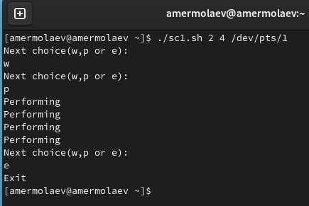
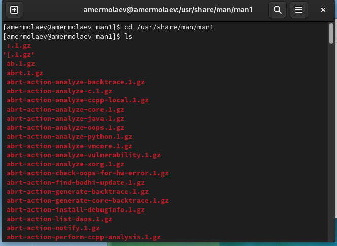
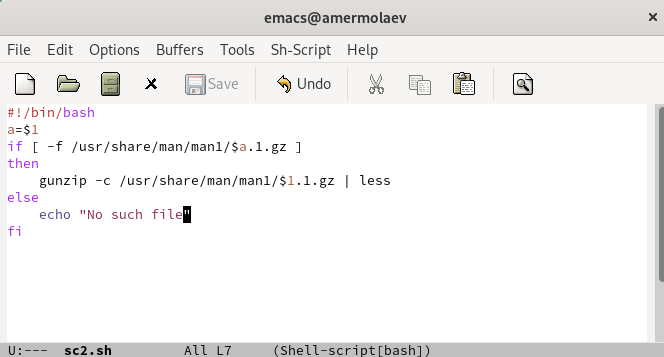
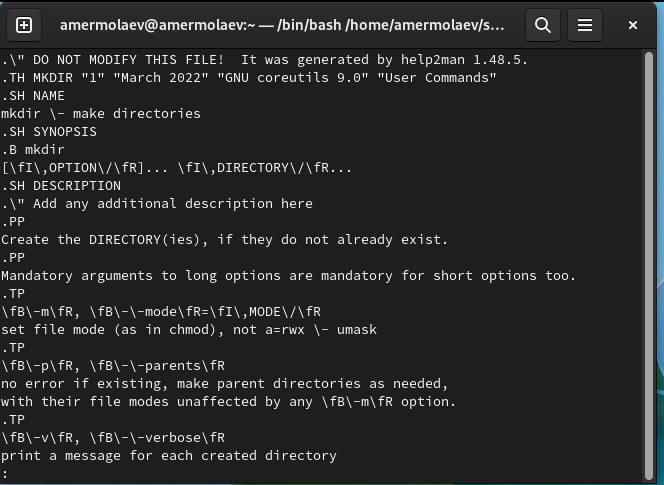
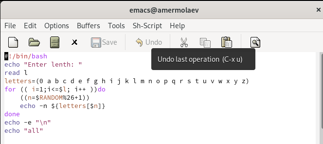
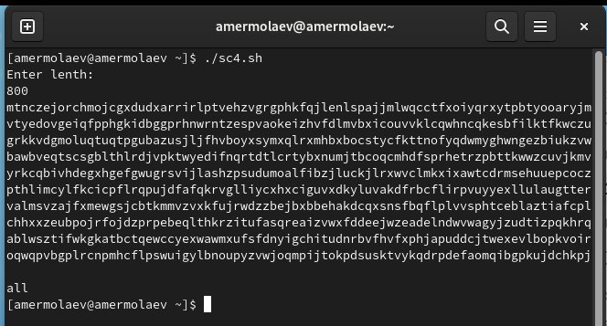

# **Отчет к лабораторной работе №12**
## **Common information**
discipline: Операционные системы  
group: НПМбд-01-21  
author: Ермолаев А.М.
---


## **Цель работы**
Изучить основы программирования в оболочке ОС UNIX. Научиться писать более сложные командные файлы с использованием логических управляющих конструкций и циклов.


## **Выполнение работы**

Напишем командный файл, реализующий упрощённый механизм семафоров. Командный файл должен в течение некоторого времени t1 дожидаться освобождения ресурса, выдавая об этом сообщение, а дождавшись его освобождения, использовать его в течение некоторого времени t2<>t1, также выдавая информацию о том, что
ресурс используется соответствующим командным файлом (процессом ). Запустим командный файл в одном виртуальном терминале в фоновом режиме, перенаправив его вывод в другой (> /dev/tty#, где # — номер терминала куда перенаправляется вывод), в котором также запущен этот файл, но не фоновом, а в привилегированном
режиме. Доработаем программу так, чтобы имелась возможность взаимодействия трёх и более процессов.


Предоставим файлу право на исполнение командой ```chmod +x sc1.sh``` и проверим корректность работы.



Реализуем команду man с помощью командного файла. Для этого изучим содержимое каталога /usr/share/man/man1. В нем находятся архивы текстовых файлов, содержащих справку по большинству установленных в системе программ и команд. Каждый архив
можно открыть командой less сразу же просмотрев содержимое справки. Командный файл должен получать в виде аргумента командной строки название команды и в виде результата выдавать справку об этой команде или сообщение об отсутствии справки,
если соответствующего файла нет в каталоге man1.





Проверим кооректность работы программы для команды mkdir.



Используя встроенную переменную $RANDOM, напишем командный файл, генерирующий случайную последовательность букв латинского алфавита. Будем иметь в виду, что $RANDOM выдаёт псевдослучайные числа в диапазоне от 0 до 32767.





## **Ответы на контрольные вопросы**
### *Вопрос 1*
В данной строке остуствуют пробелы после первой скобки и перед последней скобкой. К тому же, не лишним было бы обрамление ```$1``` в ```"```, так как данная переменная может содержать пробелы.

### *Вопрос 2*
Самый простой способ объединить две или более строковые переменные — записать их одну за другой:
```
VAR1="Hello,"
VAR2=" World"
VAR3="$VAR1$VAR2"
echo "$VAR3"
```
Вы также можете объединить одну или несколько переменных с литеральными строками:
```
VAR1="Hello,"
VAR2="${VAR1}World"
echo "$VAR2"
```

Другой способ объединения строк в bash — добавление переменных или литеральных строк к переменной с помощью оператора ```+=```:
```
VAR=""
for ELEMENT in 'Hydrogen' 'Helium' 'Lithium' 'Beryllium'; do
  VAR+="${ELEMENT} "
done

echo "$VAR"
```

### *Вопрос 3*
Команда seq выводит последовательность целых или действительных чисел, подходящую для передачи в другие программы.

Команда seq может пригодиться в различных других командах и циклах для генерации последовательности чисел.

Общий синтаксис команды «seq»:
```
seq [options] specification
```
Например, чтобы просто напечатать последовательность чисел с 1 до 4, можно воспользоваться командой ```seq 4```.

В качестве альтернативы ее можно реализовать при помощи цикла for:
```
for (( i = $1; i <= $2; i++))do
    echo $i
done
```

### *Вопрос 4*
Результамом инструкции ```$((10/3))``` будет 3, так как происходит целочисленное деление.

### *Вопрос 5*
Отличия командной оболочки zsh от bash:
- В zsh более быстрое автодополнение для cdс помощью Тab
- В zsh существует калькулятор zcalc, способный выполнять вычисления внутри терминала
- В zsh поддерживаются числа с плавающей запятой
- В zsh поддерживаются структуры данных «хэш»
- В zsh поддерживается раскрытие полного пути на основе неполных данных
- В zsh поддерживается замена части пути
- В zsh есть возможность отображать разделенный экран, такой же как разделенный экран vim

### *Вопрос 6*
Синтаксис данной конструкции корректен.

### *Вопрос 7*
Преимущества bash:
- Установлен по умолчанию в большинстве дистрибутивах Linux, MacOS
- Удобное перенаправление ввода/вывода
- Автоматизация некоторых действий с файловыми системами Linux
- Работа с серверами

Недостатки bash:
- Отсутствие дополнительных библиотек
- Не является кроссплатформенным языком
- Утилиты при выполнении скрипта запускают свои процессы, которые, в свою очередь, отражаются на быстроте выполнения этого скрипта.


## **Вывод**
В рамках выполнения работы я изучил основы программирования в оболочке ОС UNIX и научился писать более сложные командные файлы с использованием логических управляющих конструкций и циклов.