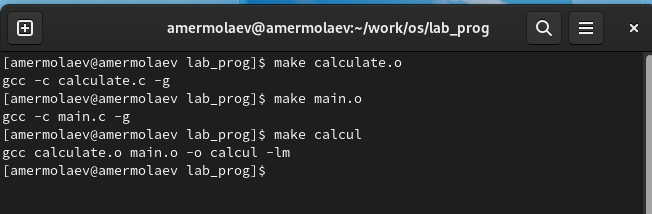
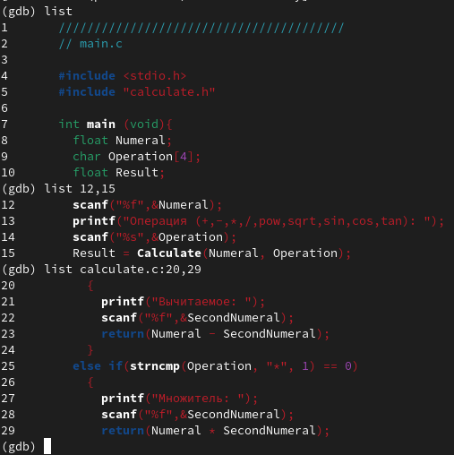
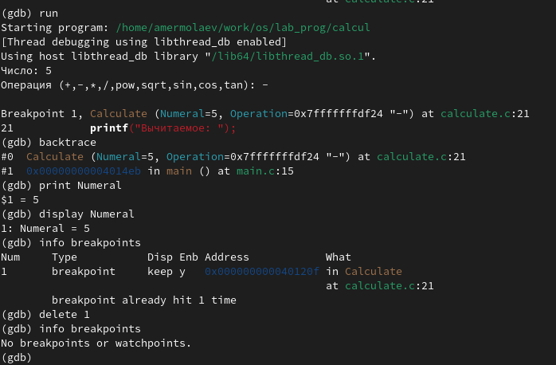
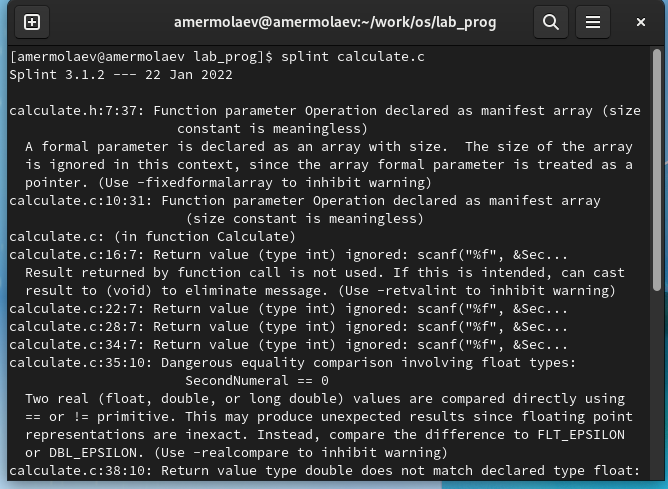

# **Отчет к лабораторной работе №13**
## **Common information**
discipline: Операционные системы  
group: НПМбд-01-21  
author: Ермолаев А.М.


## **Цель работы**
Приобрести простейшие навыки разработки, анализа, тестирования и отладки приложений в ОС типа UNIX/Linux на примере создания на языке программирования
С калькулятора с простейшими функциями.

## **Выполнение работы**
Создадим директорию г ~/work/os/lab_prog.


Создадим в нём файлы: calculate.h, calculate.c, main.c.

Напишем содержимое файла calculate.c:

```
#include <stdio.h>
#include <math.h>
#include <string.h>
#include "calculate.h"

float
Calculate(float Numeral, char Operation[4])
{
    float SecondNumeral;
    if(strncmp(Operation, "+", 1) == 0)
	{
	    printf("Второе слагаемое: ");
	    scanf("%f",&SecondNumeral);
	    return(Numeral + SecondNumeral);
	}
    else if(strncmp(Operation, "-", 1) == 0)
	{
	    printf("Вычитаемое: ");
	    scanf("%f",&SecondNumeral);
	    return(Numeral - SecondNumeral);
	}
    else if(strncmp(Operation, "*", 1) == 0)
	{
	    printf("Множитель: ");
	    scanf("%f",&SecondNumeral);
	    return(Numeral * SecondNumeral);
	}
    else if(strncmp(Operation, "/", 1) == 0)
	{
	    printf("Делитель: ");
	    scanf("%f",&SecondNumeral);
	    if(SecondNumeral == 0)
		{
		    printf("Ошибка: деление на ноль! ");
		    return(HUGE_VAL);
		}
	    else
		return(Numeral / SecondNumeral);
	}
    else if(strncmp(Operation, "pow", 3) == 0)
	{
	    printf("Степень: ");
	    scanf("%f",&SecondNumeral);
	    return(pow(Numeral, SecondNumeral));
	}
    else if(strncmp(Operation, "sqrt", 4) == 0)
	return(sqrt(Numeral));
    else if(strncmp(Operation, "sin", 3) == 0)
	return(sin(Numeral));
    else if(strncmp(Operation, "cos", 3) == 0)
	return(cos(Numeral));
    else if(strncmp(Operation, "tan", 3) == 0)
	return(tan(Numeral));
    else
	{
	    printf("Неправильно введено действие ");
	    return(HUGE_VAL);
	}
}
```
Напишем содержимое файла calculate.h:
```
#ifndef CALCULATE_H_
#define CALCULATE_H_
float Calculate(float Numeral, char Operation[4]);

#endif
```
Напишем содержимое файла main.c:
```
#include <stdio.h>
#include "calculate.h"

int
main (void)
{
    float Numeral;
    char Operation[4];
    float Result;
    printf("Число: ");
    scanf("%f",&Numeral);
    printf("Операция (+,-,*,/,pow,sqrt,sin,cos,tan): ");
    scanf("%s", Operation);
    Result = Calculate(Numeral, Operation);
    printf("%6.2f\n",Result);
    return 0;
}
```

Выполним компиляцию программы посредством gcc:


Создадим Makefile со следующим содержанием:

```
CC = gcc
CFLAGS = -g
LIBS = -lm

calcul: calculate.o main.o
	$(CC) calculate.o main.o -o calcul $(LIBS)

calculate.o: calculate.c calculate.h
	$(CC) -c calculate.c $(CFLAGS)

main.o: main.c calculate.h
	$(CC) -c main.c $(CFLAGS)
clean:
	-rm calcul *.o *~
```

Пересоберем проект с помощью данного файла.



С помощью gdb выполните отладку программы calcul.







В конце с помощью утилиты splint попробуйте проанализировать коды файлов calculate.c и main.c.




## **Ответы на контрольные вопросы**
### *Вопрос 1*
Чтобы получить информацию о возможностях программ gcc, make, gdb и др. нужно воспользоваться командой ```man -h <команда>```.

### *Вопрос 2*
Процесс разработки программного обеспечения обычно разделяется на следующие этапы: планирование, включающее сбор и анализ требований кфункционалу и другим характеристикам разрабатываемого приложения; проектирование, включающее в себя разработку базовых алгоритмов и спецификаций, определение языка программирования; непосредственная разработка приложения: кодирование − по сути создание исходного текста программы (возможно в нескольких вариантах); анализ разработанного кода; сборка, компиляция и разработка исполняемого модуля; тестирование и отладка, сохранение произведённых изменений; документирование. Для создания исходного текста программы разработчик может воспользоваться любым удобным для него редактором текста: vi, vim, mceditor, emacs, geany и др. После завершения написания исходного кода программы (возможно состоящей из нескольких файлов), необходимо её скомпилировать и получить исполняемый модуль.

### *Вопрос 3*
Для имени входного файла суффикс определяет какая компиляция требуется. Суффиксы указывают на тип объекта. Файлы с расширением (суффиксом) .c воспринимаются gcc как программы на языке С, файлы с расширением .cc или .C − как файлы на языке C++, а файлы c расширением .o считаются объектными.

### *Вопрос 4*
Основное назначение компилятора языка Си в UNIX заключается в компиляции всей программы и получении исполняемого файла/модуля.

### *Вопрос 5*
Для сборки разрабатываемого приложения и собственно компиляции полезно воспользоваться утилитой make. Она позволяет автоматизировать процесс преобразования файлов программы из одной формы в другую, отслеживает взаимосвязи между файлами.

### *Вопрос 6*
Для работы с утилитой make необходимо в корне рабочего каталога с Вашим проектом создать файл с названием makefile или Makefile, в котором будут описаны правила обработки файлов Вашего программного комплекса. В самом простом случае Makefile имеет следующий синтаксис: <цель_1> <цель_2> ... : <зависимость_1> <зависимость_2> ... <команда 1> ... <команда n> Сначала задаётся список целей, разделённых пробелами, за которым идёт двоеточие и список зависимостей. Затем в следующих строках указываются команды. Строки с командами обязательно должны начинаться с табуляции. В качестве цели в Makefile может выступать имя файла или название какого-то действия. Зависимость задаёт исходные параметры (условия) для достижения указанной цели. Зависимость также может быть названием какого-то действия. Команды − собственно действия, которые необходимо выполнить для достижения цели. Общий синтаксис Makefile имеет вид: target1 [target2...]:[:] [dependment1...] [(tab)commands] [#commentary] [(tab)commands] [#commentary] Здесь знак # определяет начало комментария (содержимое от знака # и до конца строки не будет обрабатываться. Одинарное двоеточие указывает на то, что последовательность команд должна содержаться водной строке. Для переноса можно в длинной строке команд можно использовать обратный слэш (). Двойное двоеточие указывает на то, что последовательность команд может содержаться в нескольких последовательных строках.

### *Вопрос 7*
Во время работы над кодом программы программист неизбежно сталкивается с появлением ошибок в ней. Использование отладчика для поиска и устранения ошибок в программе существенно облегчает жизнь программиста. В комплект программ GNU для ОС типа UNIX входит отладчик GDB (GNU Debugger). Для использования GDB необходимо скомпилировать анализируемый код программы таким образом, чтобы отладочная информация содержалась в результирующем бинарном файле. Для этого следует воспользоваться опцией -g компилятора gcc: gcc -c file.c -g После этого для начала работы с gdb необходимо в командной строке ввести одноимённую команду, указав в качестве аргумента анализируемый бинарный файл: gdb file.o

### *Вопрос 8*
Основные команды отладчика gdb: backtrace − вывод на экран пути к текущей точке останова (по сути вывод − названий всех функций) break − установить точку останова (в качестве параметра может быть указан номер строки или название функции) clear − удалить все точки останова в функции continue − продолжить выполнение программы delete − удалить точку останова display − добавить выражение в список выражений, значения которых отображаются при достижении точки останова программы finish − выполнить программу до момента выхода из функции info breakpoints − вывести на экран список используемых точек останова info watchpoints − вывести на экран список используемых контрольных выражений list − вывести на экран исходный код (в качестве параметра может быть указано название файла и через двоеточие номера начальной и конечной строк) next − выполнить программу пошагово, но без выполнения вызываемых в программе функций print − вывести значение указываемого в качестве параметра выражения run − запуск программы на выполнение set − установить новое значение переменной step − пошаговое выполнение программы watch − установить контрольное выражение, при изменении значения которого программа будет остановлена Для выхода из gdb можно воспользоваться командой quit (или её сокращённым вариантом q) или комбинацией клавиш Ctrl-d. Более подробную информацию по работе с gdb можно получить с помощью команд gdb -h и man gdb.

### *Вопрос 9*
Cхема отладки программы показана в 6 пункте лабораторной работы.

### *Вопрос 10*
При первом запуске компилятор не выдал никаких ошибок, но в коде программы main.c допущена ошибка, которую компилятор мог пропустить (возможно, из-за версии 8.3.0-19): в строке scanf(“%s”, &Operation); нужно убрать знак &, потому что имя массива символов уже является указателем на первый элемент этого массива.

### *Вопрос 11*
Система разработки приложений UNIX предоставляет различные средства, повышающие понимание исходного кода. К ним относятся: cscope − исследование функций, содержащихся в программе, lint − критическая проверка программ, написанных на языке Си.

### *Вопрос 12*
Утилита splint анализирует программный код, проверяет корректность задания аргументов использованных в программе функций и типов возвращаемых значений, обнаруживает синтаксические и семантические ошибки. В отличие от компилятора C анализатор splint генерирует комментарии с описанием разбора кода программы и осуществляет общий контроль, обнаруживая такие ошибки, как одинаковые объекты, определённые в разных файлах, или объекты, чьи значения не используются в работепрограммы, переменные с некорректно заданными значениями и типами и многое другое.

## **Вывод**
В рамках выполнения работы я приобрел простейшие навыки разработки, анализа, тестирования и отладки приложений в ОС типа UNIX/Linux на примере создания на языке программирования
С калькулятора с простейшими функциями.