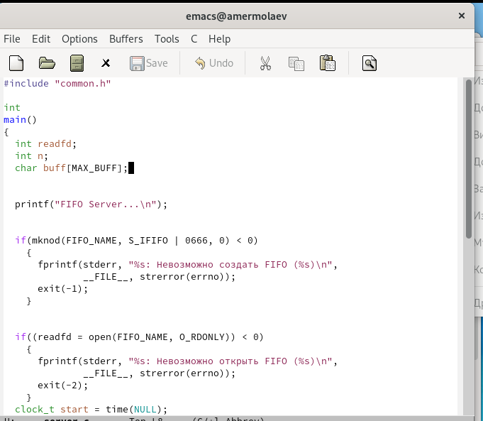

---
## Front matter
lang: ru-RU
title: Презентация к лабораторной работе №14
author: Ермолаев А.М.
group: НПМбд-01-21

## Formatting
toc: false
slide_level: 2
theme: metropolis
header-includes: 
 - \metroset{progressbar=frametitle,sectionpage=progressbar,numbering=fraction}
 - '\makeatletter'
 - '\beamer@ignorenonframefalse'
 - '\makeatother'
aspectratio: 43
section-titles: true
---

# Презентация к лабораторной работе №14

# Цель работы

Цель работы: приобрести практический навык работы с именованными каналами.

# Выполнение работы

## Файл server.c

## Файл client.c

## Файл common.h 

## Файл Make  

## Сборка проекта и проверка работы

# Вывод
## В рамках выполнения работы я приобрел практический навык работы с именованными каналами.

# Финал
