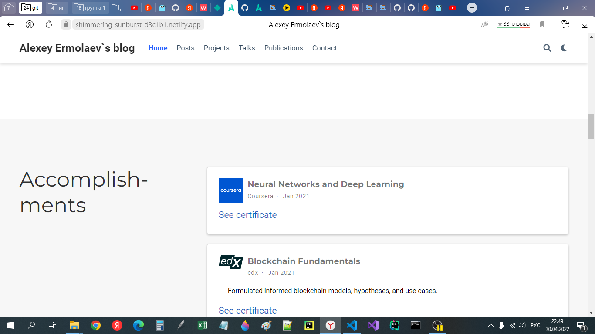

# **Отчет о выполнении этапа 1 индивидульного проекта**
## **Common information**
discipline: Операционные системы  
group: НПМбд-01-21  
author: Ермолаев А.М.


## **Цель**
Произвести следующие действия:
- Установить необходимое программное обеспечение.
- Скачать шаблон темы сайта.
- Разместить его на хостинге git.
- Установить параметр для URLs сайта.
- Разместить заготовку сайта на Github pages.
## **Выполнение**

Установим необходимое програмное обеспечение(изначально мне небоходимо было установить менеджер пакетов Chocolatey).


Выберем шаблон по ссылке https://wowchemy.com/hugo-themes/

Создадим репозиторий для сайта в приложении Netlify.


Затем клонируем репозиторий в заготовленную заранее папку при помощи команды ```git clone <ссылка>```.

На даный момент наш сайт выглядит так:


Откроем папку в удобном тестовом редакторе(у меня это VSCode). Перейдем в папку config и откроем файл config.yaml.
Добавим ссылку репозитория с Netlify в baseURL. Также изменим поле title.


Чтобы убрать зеленый раздел в начале, надо перейти в папку content, затем перейти в папку home и удалить файл demo.md.

После этого произведем стандартные процедуры отправки изменений на удаленный репозиторий при помощи команд git add, commit, push.

Теперь наш сайт выглядит так:



## **Вывод**
В рамках выполнения работы я выполнил пункт 1 индивидуального проекта.
