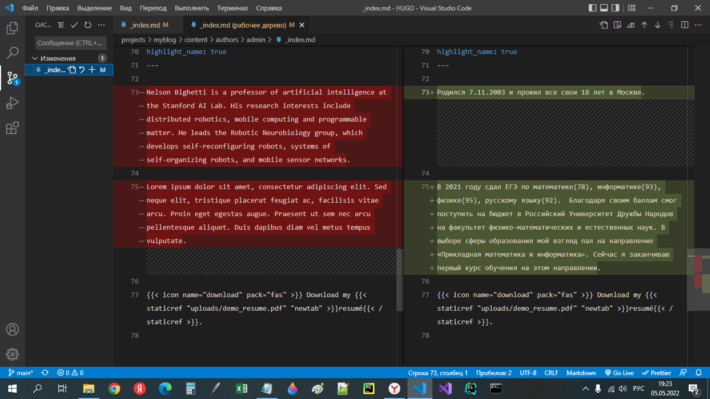
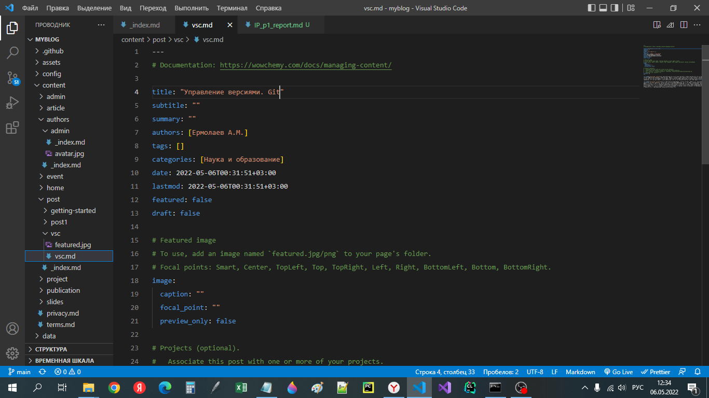
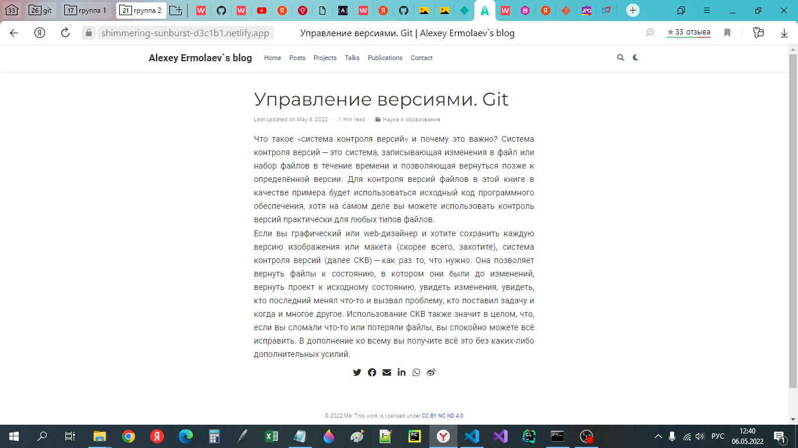

---
## Front matter
lang: ru-RU
title: Презентация к этапу 2 индивидуального проекта
author: Ермолаев А.М.
group: НПМбд-01-21

## Formatting
toc: false
slide_level: 2
theme: metropolis
header-includes: 
 - \metroset{progressbar=frametitle,sectionpage=progressbar,numbering=fraction}
 - '\makeatletter'
 - '\beamer@ignorenonframefalse'
 - '\makeatother'
aspectratio: 43
section-titles: true
---

## **Цель**
Произвести следующие действия:
- Разместить фотографию владельца сайта.
- Разместить краткое описание владельца сайта (Biography).
- Добавить информацию об интересах (Interests).
- Добавить информацию от образовании (Education).
- Сделать пост по прошедшей неделе.
- Добавить пост на тему по выбору:
    + Управление версиями. Git.
    + Непрерывная интеграция и непрерывное развертывание (CI/CD).
## **Выполнение**
### Добавление к сайту данных о себе.

```
<ваш проект>\content\authors\admin\_index.md
```





### Создание и заполнение поста

```
hugo new post/<название поста с расширением md>
```






# Вывод
В рамках выполнения работы я выполнил пункт 2 индивидуального проекта.

