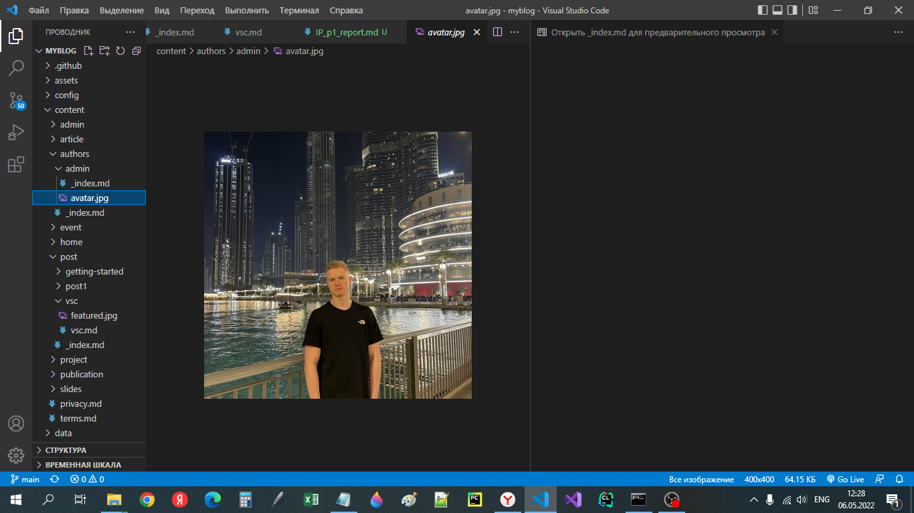
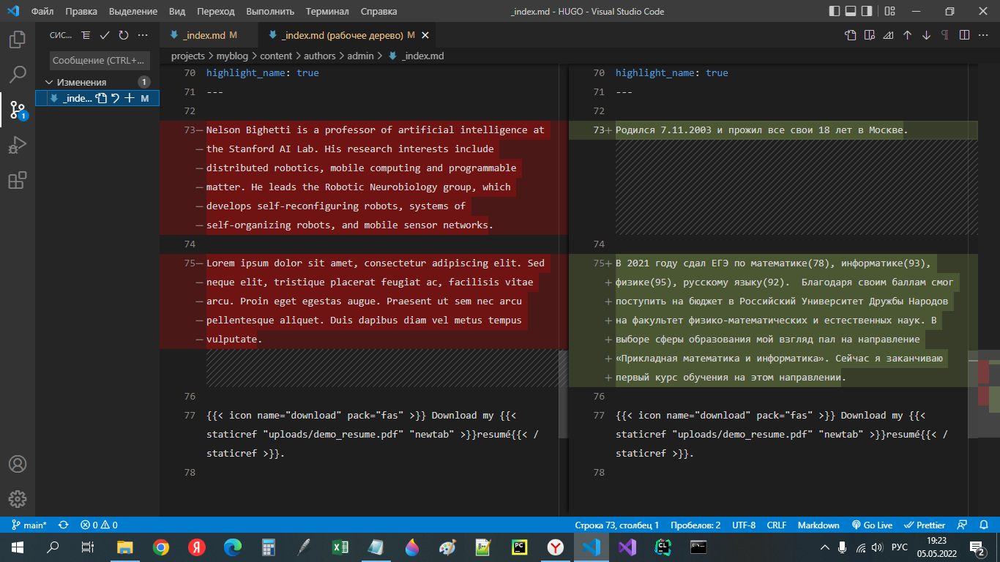
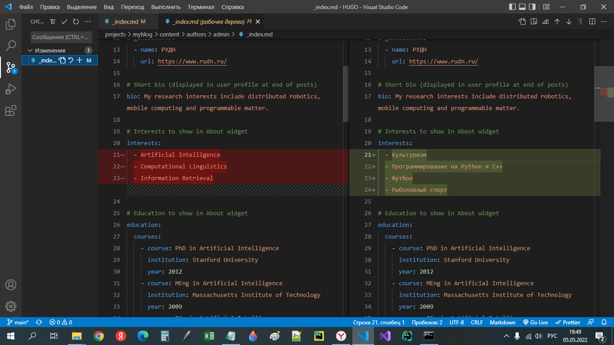
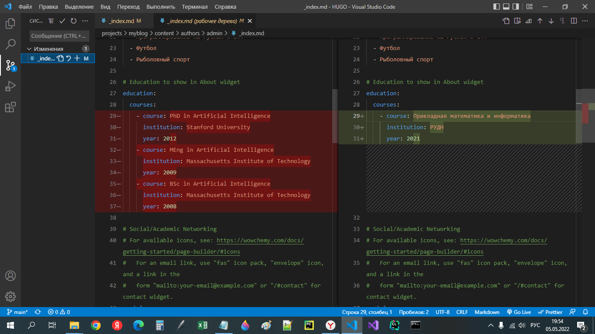
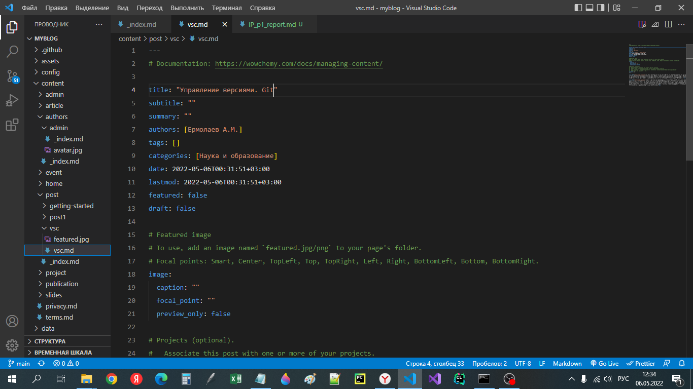
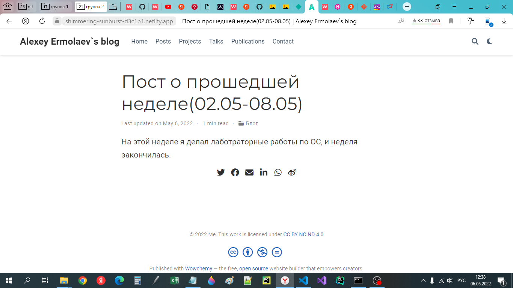
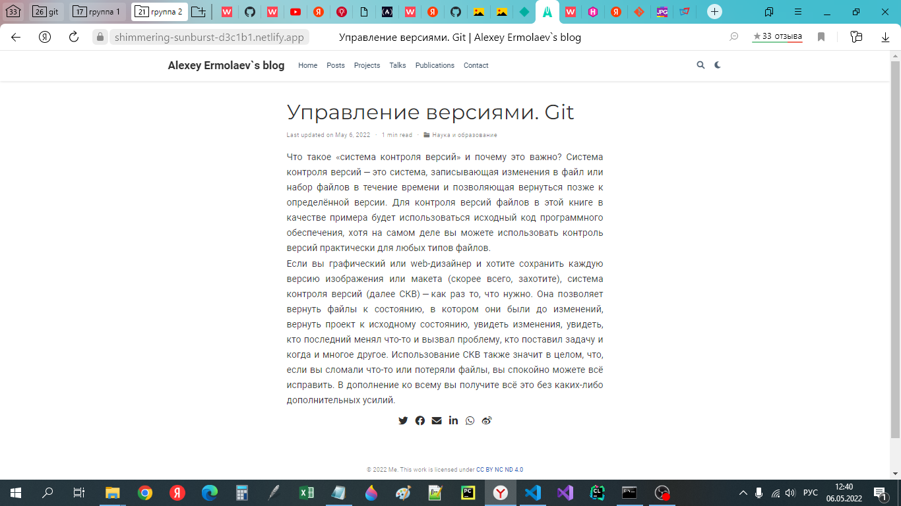

# **Отчет о выполнении этапа 2 индивидуального проекта**
## **Common information**
discipline: Операционные системы  
group: НПМбд-01-21  
author: Ермолаев А.М.


## **Цель**
Произвести следующие действия:
- Разместить фотографию владельца сайта.
- Разместить краткое описание владельца сайта (Biography).
- Добавить информацию об интересах (Interests).
- Добавить информацию от образовании (Education).
- Сделать пост по прошедшей неделе.
- Добавить пост на тему по выбору:
    + Управление версиями. Git.
    + Непрерывная интеграция и непрерывное развертывание (CI/CD).

## **Выполнение**

Добавим данные о себе, перейдя по адресу
```
<ваш проект>\content\authors\admin\_index.md
```
Для изменения изображения нужно заменить изображение   ```avatar.jpg``` на новое изображение с с таким же названием и расширением(также я сохранил размер (400 X 400)).




Краткое описание владельца сайте можно заполнить в самом низу файла.



Интересы размещаются в разделе Interests.



Образование размещается в разделе Education.



Для создания поста воспользуемся следующей командой:

```
hugo new post/<название поста с расширением md>
```
Данный файл будет имеет следующую разметку.



Заполним соответсвующие поля и разместим текст в самом низу файла.

По итогу наш пост имеет следующий вид(отображается в раздлеле Posts):



Аналогичным образом оформим пост об управлении версиями.



## **Вывод**
В рамках выполнения работы я выполнил пункт 2 индивидуального проекта.
