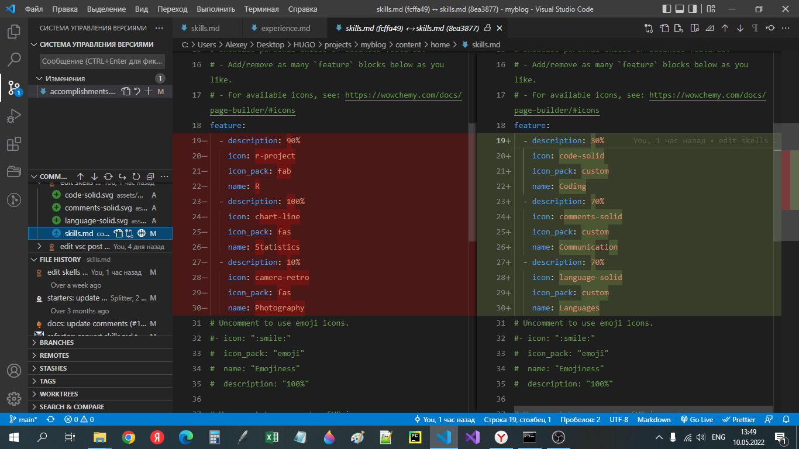
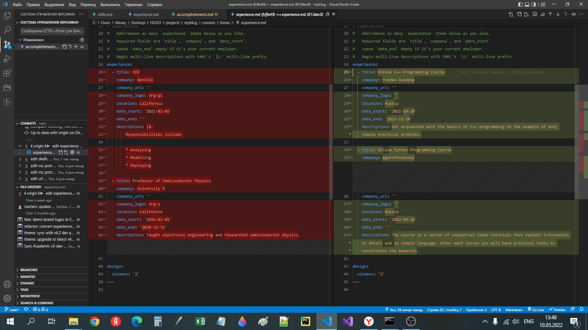
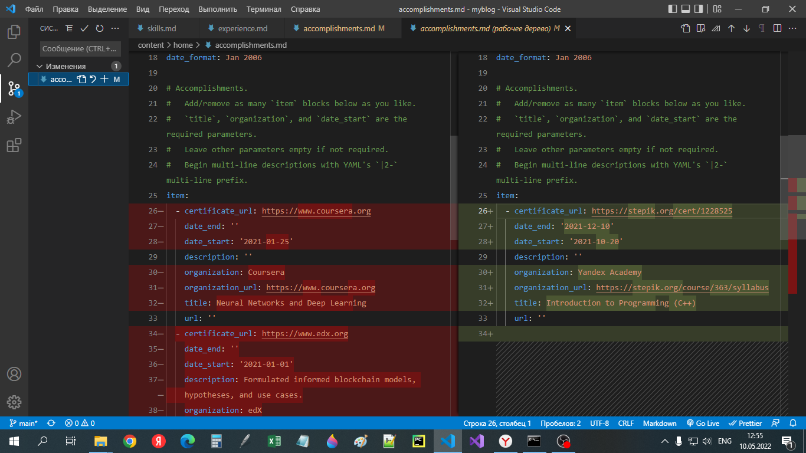
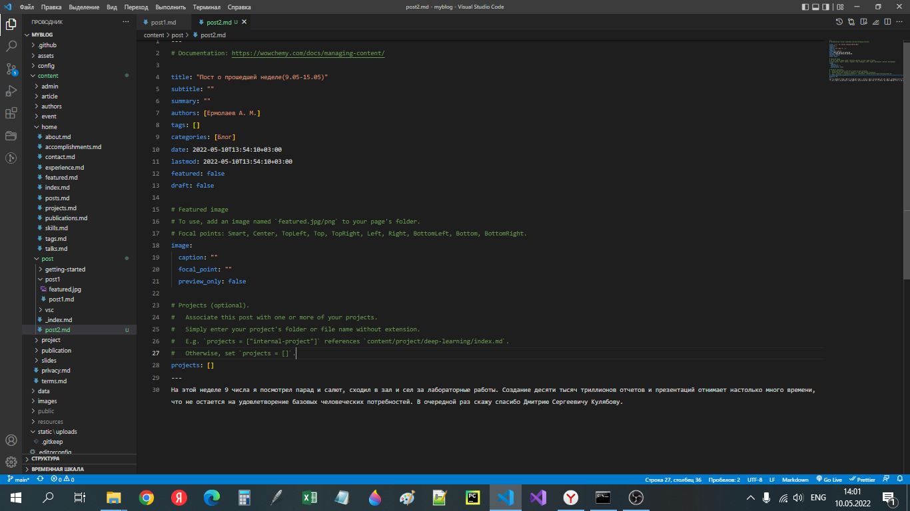
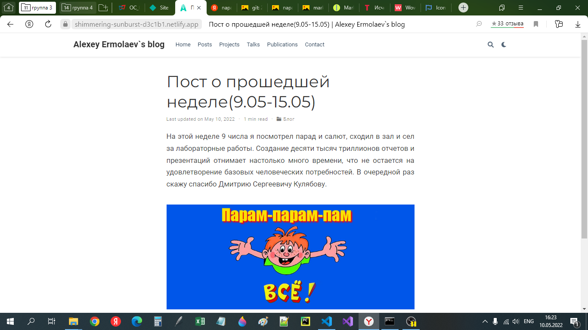
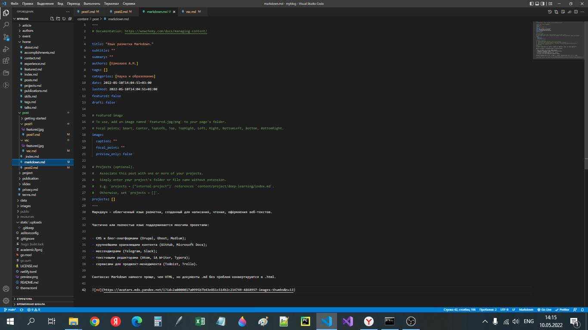
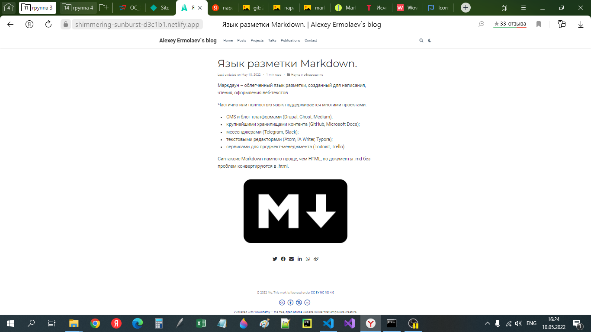

---
## Front matter
lang: ru-RU
title: Презентация к этапу 3 индивидуального проекта
author: Ермолаев А.М.
group: НПМбд-01-21

## Formatting
toc: false
slide_level: 2
theme: metropolis
header-includes: 
 - \metroset{progressbar=frametitle,sectionpage=progressbar,numbering=fraction}
 - '\makeatletter'
 - '\beamer@ignorenonframefalse'
 - '\makeatother'
aspectratio: 43
section-titles: true
---

## **Цель**
Произвести следующие действия:
- Добавить к сайту достижения.
    + Добавить информацию о навыках (Skills).
    + Добавить информацию об опыте (Experience).
    + Добавить информацию о достижениях (Accomplishments).
- Сделать пост по прошедшей неделе.
- Добавить пост на тему по выбору:
    + Легковесные языки разметки.
    + Языки разметки. LaTeX.
    + Язык разметки Markdown.


## **Выполнение**
### Добавление к сайту достижений.

```
<ваш проект>\content\home
```







### Создание и заполнение постов

```
hugo new post/<название поста с расширением md>
```









# Вывод
В рамках выполнения работы я выполнил пункт 2 индивидуального проекта.

