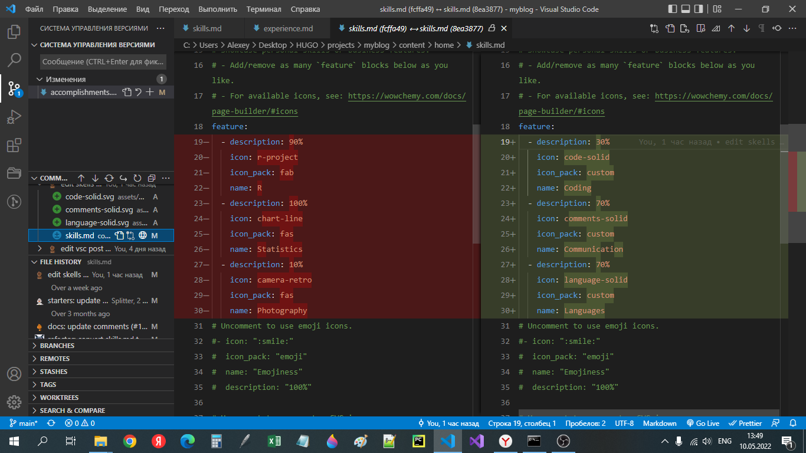
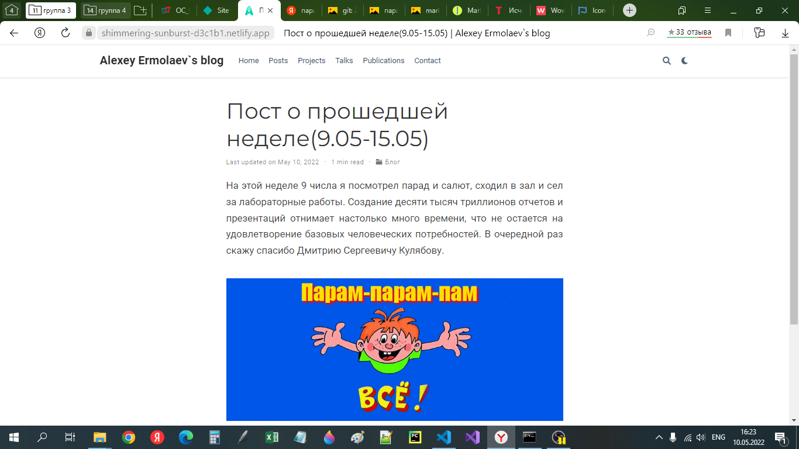

# **Отчет о выполнении этапа 3 индивидуального проекта**
## **Common information**
discipline: Операционные системы  
group: НПМбд-01-21  
author: Ермолаев А.М.


## **Цель**
Произвести следующие действия:
- Добавить к сайту достижения.
    + Добавить информацию о навыках (Skills).
    + Добавить информацию об опыте (Experience).
    + Добавить информацию о достижениях (Accomplishments).
- Сделать пост по прошедшей неделе.
- Добавить пост на тему по выбору:
    + Легковесные языки разметки.
    + Языки разметки. LaTeX.
    + Язык разметки Markdown.

## **Выполнение**

Добавим данные о себе, перейдя по адресу
```
<ваш проект>\content\home\
```
Для редактирования информации о навыках нужно произвести соответствующие изменения в файле skills.md. 

Отдельно стоит упомянуть о изменении иконок. Для этого можно перейти по адресу https://fontawesome.com/icons?d=gallery&s=brands, выбрать соответствующую иконку, скачать ее и затем переместить svg файл в 
```<ваш проект>\assets\media\icons```. При заполнении разметки в поле icon надо записать имя файла без расширения, а в разделе icon_pack - custom.

```
icon: <имя svg файла>
icon_pack: custom
```




Для редактирования информации об опыте нужно произвести соответствующие изменения в файле experience.md. 


Достижения размещаются в файле accomplishments.md.


После этого, при помощи команды ```hugo new post/<название поста с расширением md>``` были созданы md файлы для создания постов о прошедшей неделе и языке разметки Markdown.





## **Вывод**
В рамках выполнения работы я выполнил пункт 3 индивидуального проекта.
