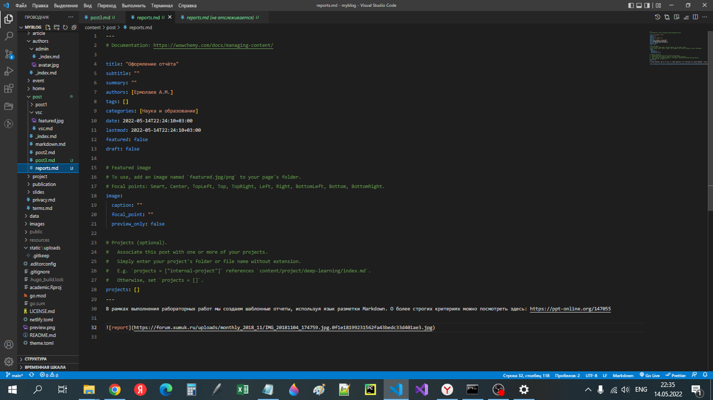
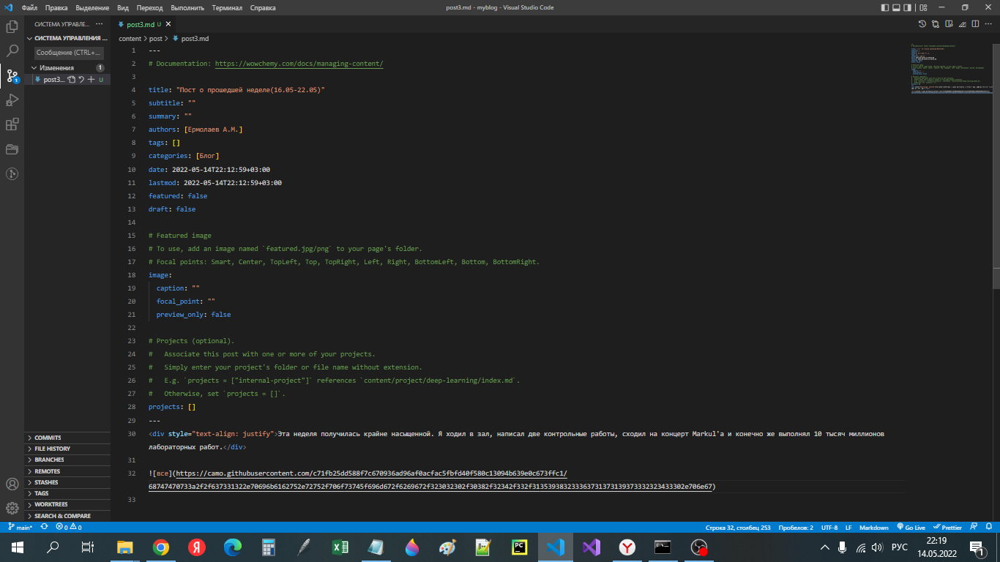
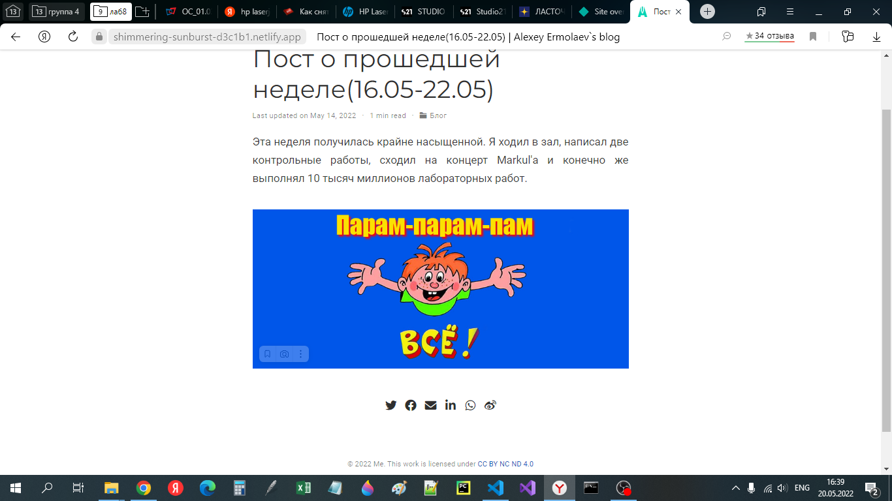

---
## Front matter
lang: ru-RU
title: Презентация к 4 этапу индивидуального проекта
author: Ермолаев А.М.
group: НПМбд-01-21

## Formatting
toc: false
slide_level: 2
theme: metropolis
header-includes: 
 - \metroset{progressbar=frametitle,sectionpage=progressbar,numbering=fraction}
 - '\makeatletter'
 - '\beamer@ignorenonframefalse'
 - '\makeatother'
aspectratio: 43
section-titles: true
---

# Презентация к 4 этапу индивидуального проекта

# Цель работы

Добавить к сайту ссылки на научные и библиометрические ресурсы, а также добавить посты о прошедшей неделе и на тему "Оформление отчёта".

# Выполнение работы

## Добавление ссылок на сайт

## Создание постов

 

# Вывод
## В рамках выполнения работы я выполнил 4 этап индивидуального проекта.

# Финал
