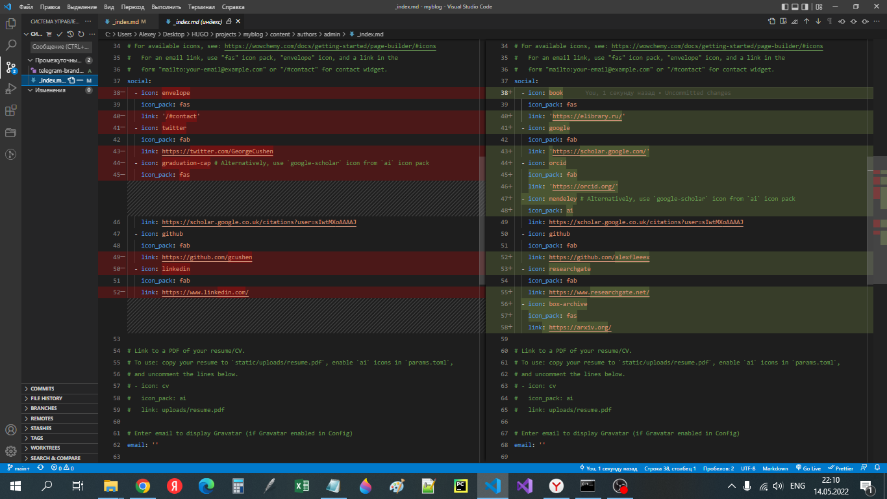
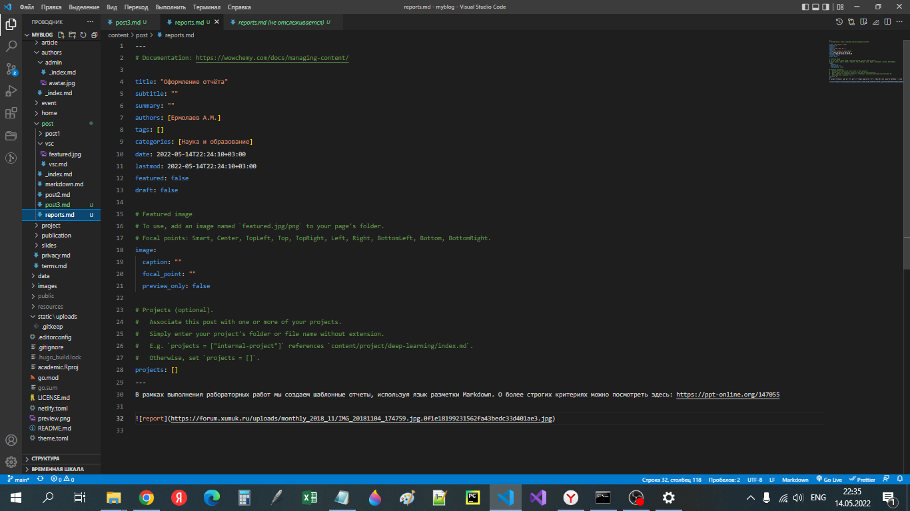
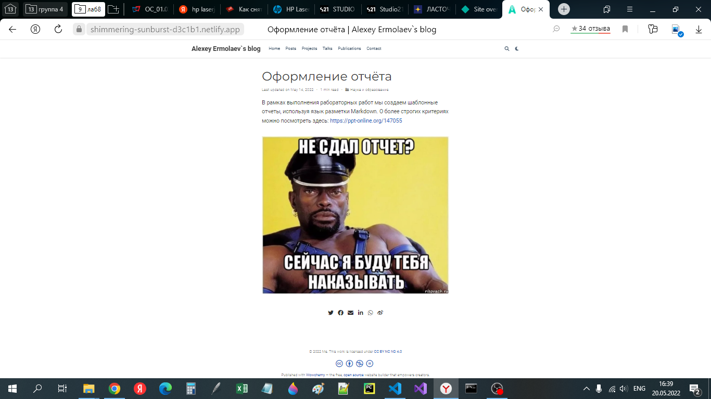
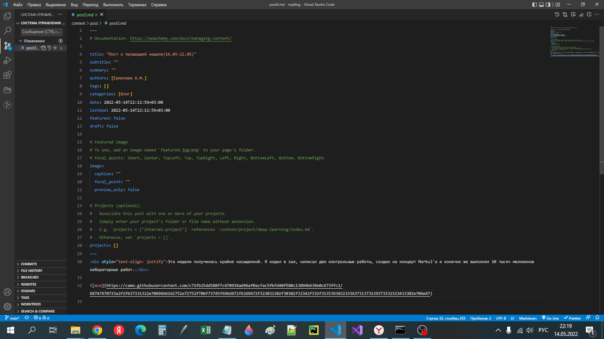
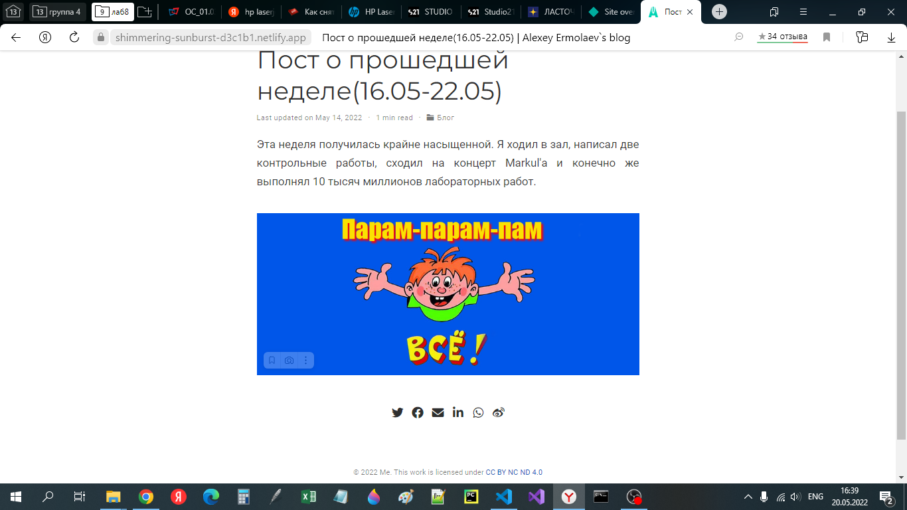

# **Отчет к 4 этапу индивидуального проекта**
## **Common information**
discipline: Операционные системы  
group: НПМбд-01-21  
author: Ермолаев А.М.


## **Цель работы**
Добавить к сайту ссылки на научные и библиометрические ресурсы, а также добавить посты о прошедшей неделе и на тему "Оформление отчёта".
## **Выполнение работы**
Добавим к сайту соответствующие ссылки, перейдя в файл с расположением

``` content\authors\admin\_index.md```

Изменения будем проводить в разделе social. Каждая ссылка имеет 4 поля. Иконку можно записать в поле icon, набор иконок - в iconpack(обычно fab или fas)и ссылку-в поле links.  



Затем создадим два поста о прошедшей неделе и оформлении отчета.










## **Вывод**
В рамках выполнения работы я выполнил 4 этап индивидуального проекта.
 