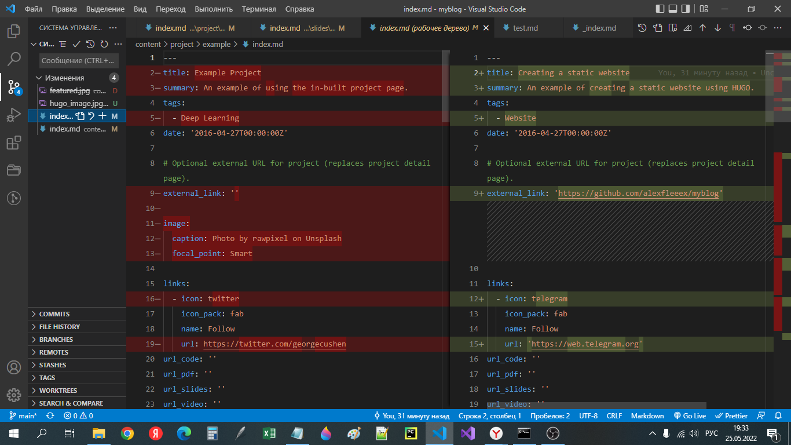
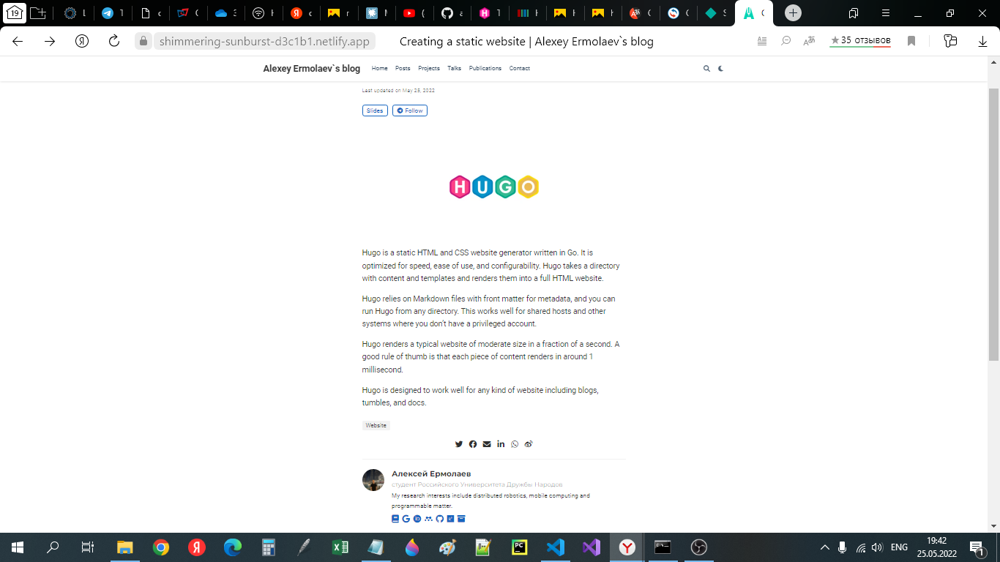
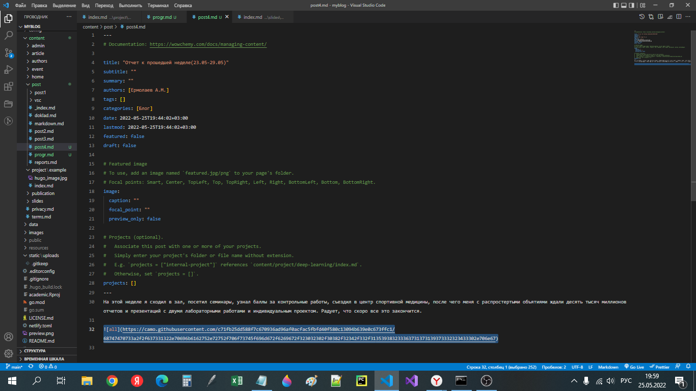

---
## Front matter
lang: ru-RU
title: Презентация к 5 этапу индивидуального проекта
author: Ермолаев А.М.
group: НПМбд-01-21

## Formatting
toc: false
slide_level: 2
theme: metropolis
header-includes: 
 - \metroset{progressbar=frametitle,sectionpage=progressbar,numbering=fraction}
 - '\makeatletter'
 - '\beamer@ignorenonframefalse'
 - '\makeatother'
aspectratio: 43
section-titles: true
---

# Презентация к 5 этапу индивидуального проекта

# Цель работы

Цель работы: Добавить с сайту все остальные элементы и создать посты о прошедшей неделе и по выбору.

# Выполнение работы

## Работа с разделом "Projects"

## Создание постов

# Вывод
## В рамках выполнения работы я реализовал 5 этап индивидуального проекта.

# Финал
