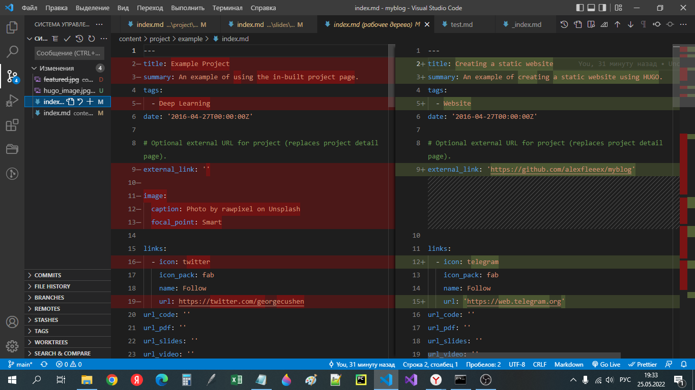
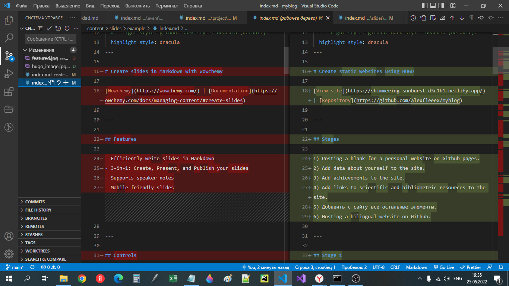
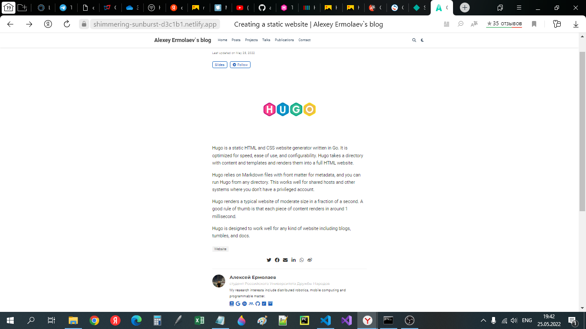
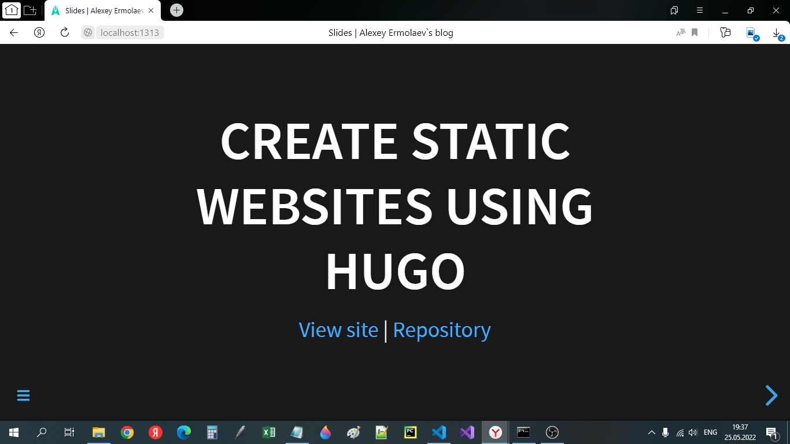
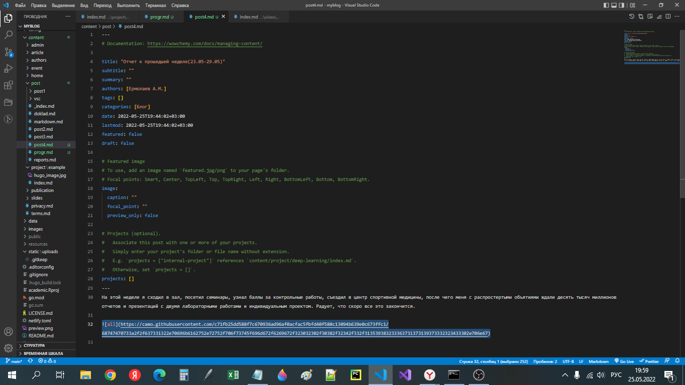
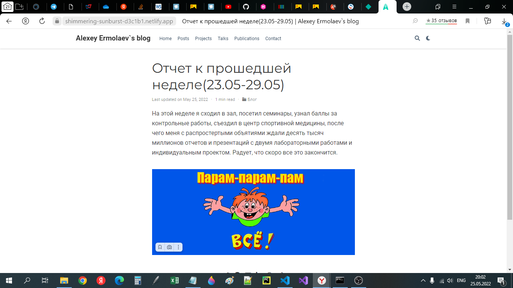
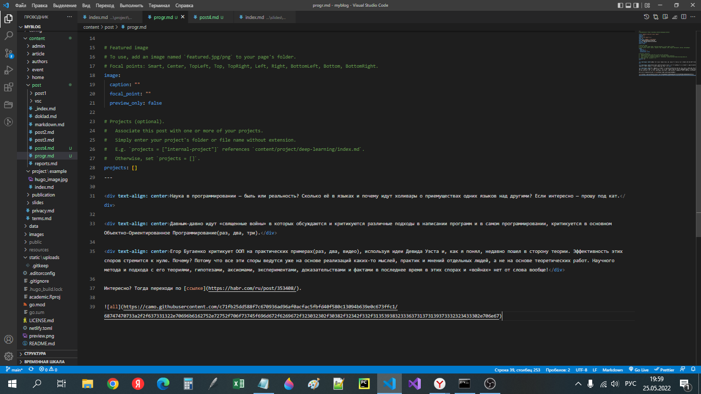
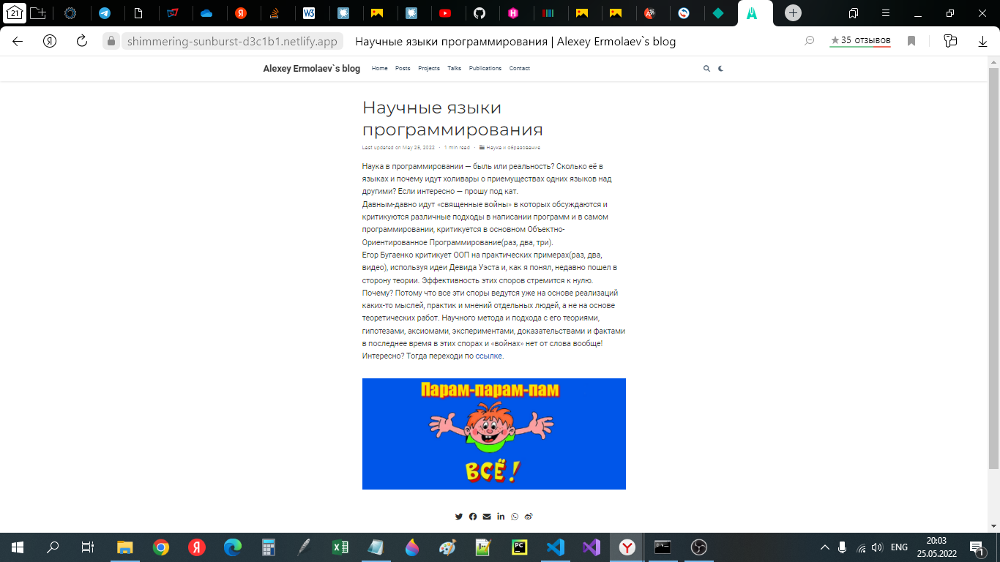

# **Отчет к 5 этапу индивидуального проекта**
## **Common information**
discipline: Операционные системы  
group: НПМбд-01-21  
author: Ермолаев А.М.


## **Цель работы**
Цель работы: Добавить с сайту все остальные элементы и создать посты о прошедшей неделе и по выбору.


## **Выполнение работы**
Для редактирования информации о проектах перейдем по данному адресу.

```
<ваш проект>\content\project\example\index.md
```

Данный файл имеет следующую разметку.



Интересно добавление некой "презентации" в поле slides. Для ее отображение надо сооздать файл md с соответствующей разметкой и добавить его по данному относительному пути:
```
<ваш проект>\content\slides
```



Теперь раздел с проектами имеет следующий вид:





Затем были созданы два поста.









## **Вывод**
В рамках выполнения работы я реализовал 5 этап индивидуального проекта.