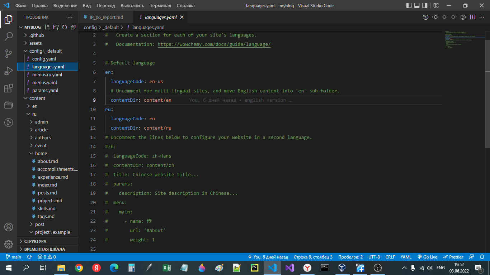
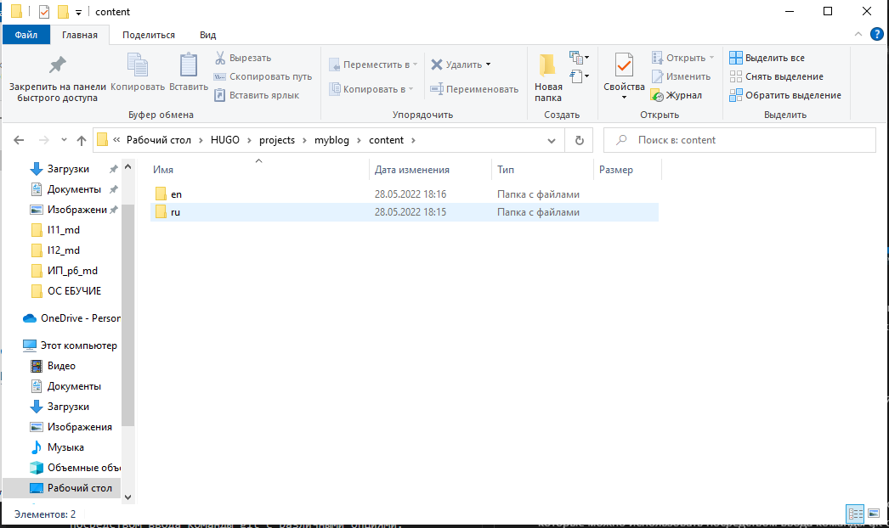
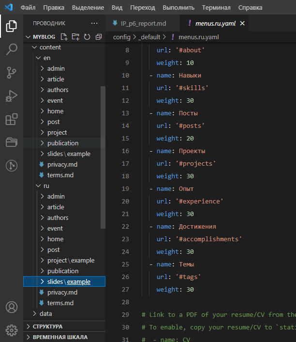

---
## Front matter
lang: ru-RU
title: Презентация к 6 этапу индивидуального проекта
author: Ермолаев А.М.
group: НПМбд-01-21

## Formatting
toc: false
slide_level: 2
theme: metropolis
header-includes: 
 - \metroset{progressbar=frametitle,sectionpage=progressbar,numbering=fraction}
 - '\makeatletter'
 - '\beamer@ignorenonframefalse'
 - '\makeatother'
aspectratio: 43
section-titles: true
---

# Презентация к 6 этапу индивидуального проекта
# Цель работы

Выполнить следующие задания:
- Сделать поддержку английского и русского языков.
- Разместить элементы сайта на обоих языках.
- Разместить контент на обоих языках.
- Сделать пост по прошедшей неделе.
- Добавить пост на тему по выбору (на двух языках)

# Выполнение работы

## Изменения в файле languages.yaml

## Изменения в папке content

## Перевод меню  

## Финальная версия сайта 

[саааааааааааааааааааайт](https://shimmering-sunburst-d3c1b1.netlify.app/)

# Вывод
## В рамках выполнения работы я выполнил 6 этап индивидуального проекта.

# Финал
