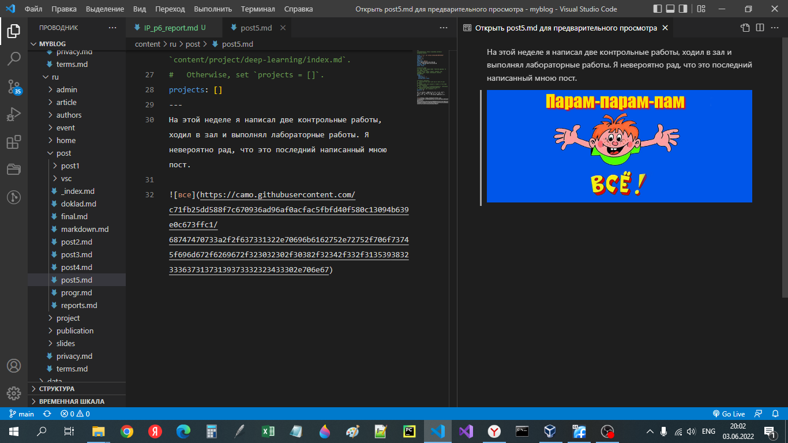
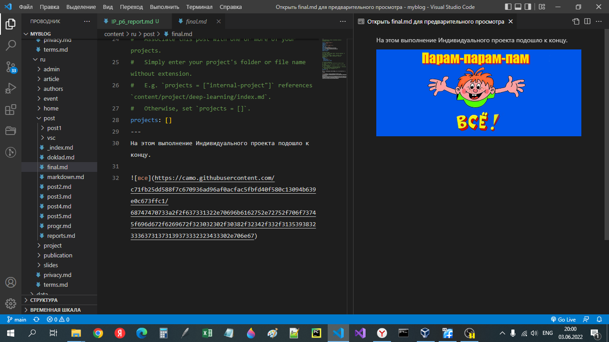

# **Отчет к 6 этапу ИП**

## **Common information**
discipline: Операционные системы  
group: НПМбд-01-21  
author: Ермолаев А.М.


## **Цель работы**
Выполнить следующие задания:
- Сделать поддержку английского и русского языков.
- Разместить элементы сайта на обоих языках.
- Разместить контент на обоих языках.
- Сделать пост по прошедшей неделе.
- Добавить пост на тему по выбору (на двух языках)

## **Выполнение работы**

Для начала создаим  два поста на русском языке при помощи команды ```hugo new post/<файл md>```.





Затем перейдем к двухъязычной поддержке сайта. Для этого произведем изменения в файле languages.yaml в папке config.


В данном файле в поле contentDir мы прописали путь до папки с контентом на соответствующим языком, поэтому в папке content необходимо создать папку с названием, являющимся кодировкой языка и перенесем все содержимое туда. 


По итогу у нас должно получиться две папки с одинаковым файловым содержимим.

После чего остается лишь перевести контент на новый язык.

Также хотел бы сказать о том, что при желании изменить меню в шапке сайта необходимо создать файл ```menus.<кодировка>.yaml``` и изменить соответсвующие поля.


По окончании работы наш сайт имеет следующий вид:
[сайт](https://shimmering-sunburst-d3c1b1.netlify.app/ru/)


## **Вывод**
В рамках выполнения работы я выполнил 6 этап Индивидуального проекта.