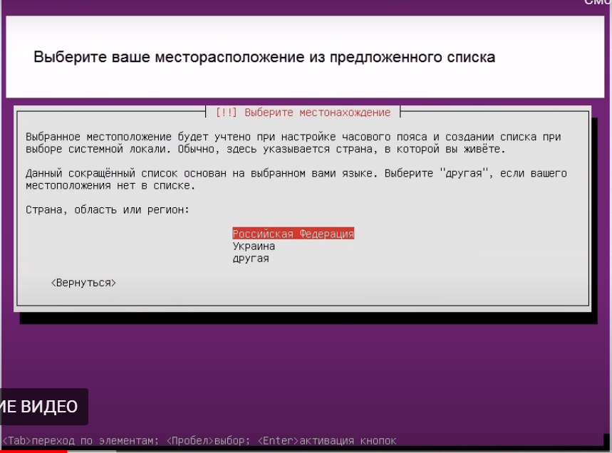
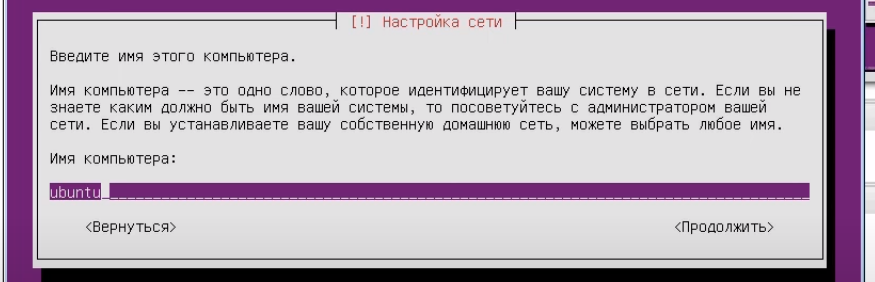
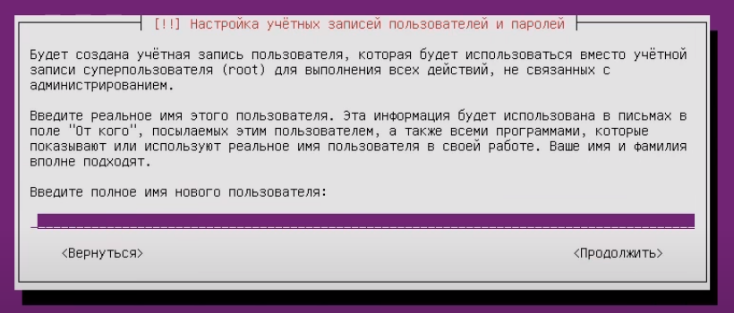
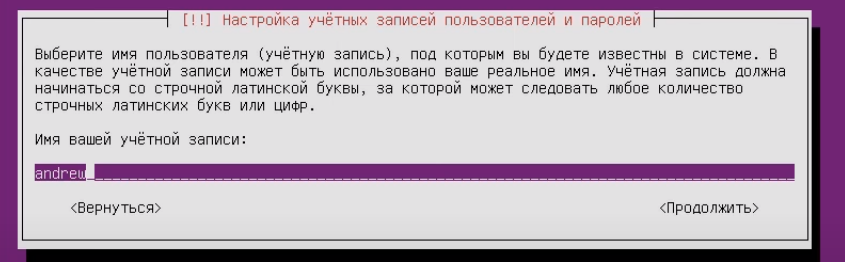
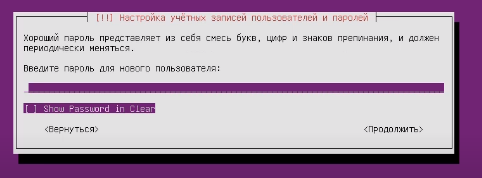
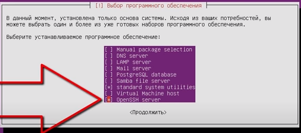
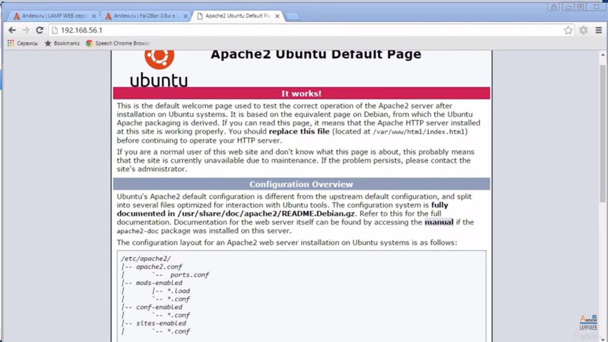
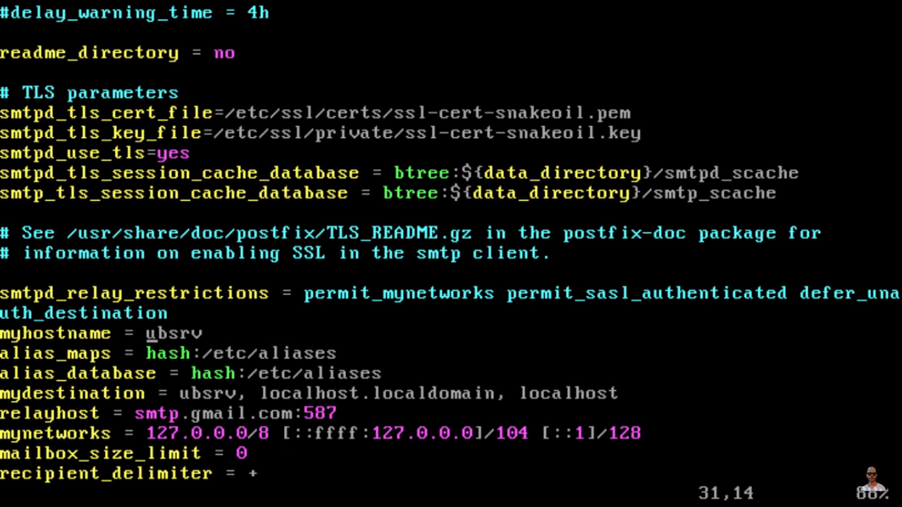
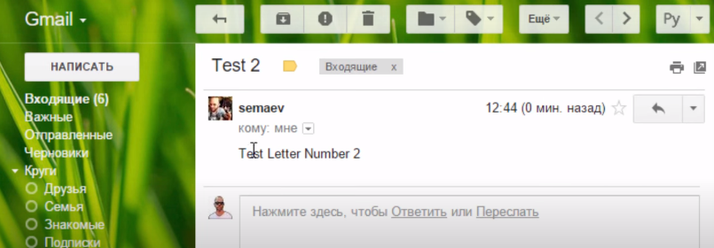
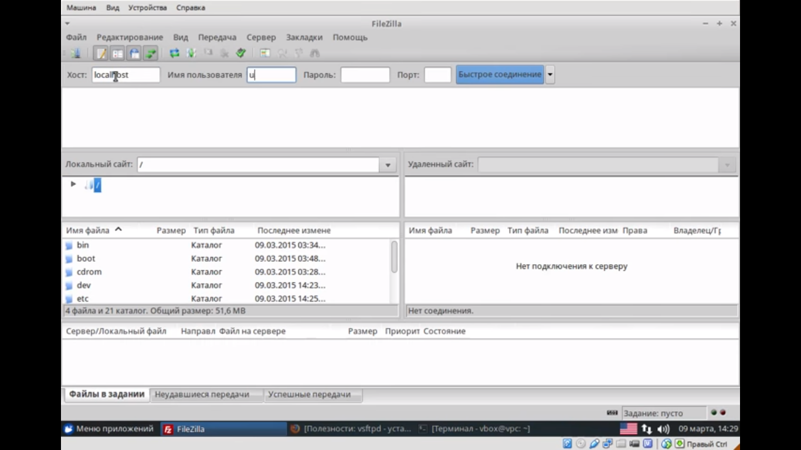

---
## Front matter
lang: ru-RU
title: Презентация на тему ""Настройка сервера в Linux"
author: Ермолаев А.М.
group: НПМбд-01-21

## Formatting
toc: false
slide_level: 2
theme: metropolis
header-includes: 
 - \metroset{progressbar=frametitle,sectionpage=progressbar,numbering=fraction}
 - '\makeatletter'
 - '\beamer@ignorenonframefalse'
 - '\makeatother'
aspectratio: 43
section-titles: true
---

# Презентация на тему ""Настройка сервера в Linux"

## Установка и настройка Ubuntu Server

**Этапы установки:**
1) Выбор языка и регион проживания.
2) Ввод имени администратора имя администратора, которое будет использоваться для управления сервером.
3) Задание имя пользователя в поле «Username for your account». Под этим аккаунтом будет происходить общение с техподдержкой Ubuntu.
4) Ввод и подтверждение пароля.
5) Указание домена при наличии. На нём будут находиться все сервисы: файловый (FTP), почтовый, хостинг для сайтов и так далее.
6) Установка дополнительных компонентов.












**Обязательные компоненты**
- Open SSh. 
- LAMP. 



**Проверка обновлений**
```
sudo apt-get update
sudo apt-get upgrade
 ```

 ## Локальный Web-сервер
 **Настройка Web-сервера**
 1) Установка phpMyAdmin. 
```
sudo apt-get install phpmyadmin
sudo service apache2 restart
```

2) Действия, связанные с версией ОС

Ubuntu 13.1
```
sudo ln -s /etc/phpmyadmin/apache.conf /etc/apache2/conf-available/phpmyadmin.conf
sudo a2enconf phpmyadmin
sudo /etc/init.d/apache2 reload
```
Ubuntu 16.04
```
sudo apt-get install php-mbstring php-gettext
sudo phpenmod mcrypt
sudo phpenmod mbstring
sudo systemctl restart apache2
```
После их ввода и автоматического перезапуска службы по адресу 

```http://[iP сервера]/phpmyadmin``` 

будет доступен веб-интерфейс.



## Почтовый сервер
**Работа с сервером**
1) Установка компонента Postfix
 ```
 sudo apt-get postfix
 ```
2) Начало работы сервиса
```
sudo /etc/initd/postfix start
```
3) Настройка параметров в файле ``` /etc/postfix/main.cf```



**Результат работы сервера**
```
echo "Test Letter Number 2" mail -s "Test 2"
```



## Файловый сервер
**Создание сервера**

1) Установка vsFTPd

```
sudo apt-get install vsftpd
```

2) Дополнительные настройки


По окончании наш сервер будет иметь следующий вид


## Вывод
Создание серверов на Linux удобно и доступно.

