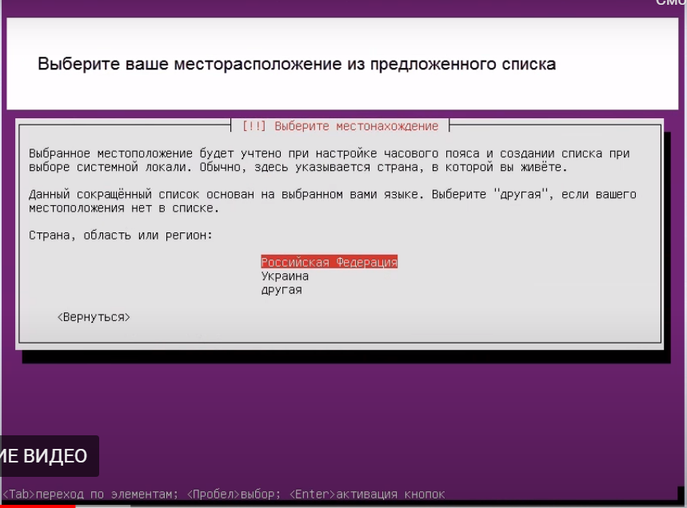
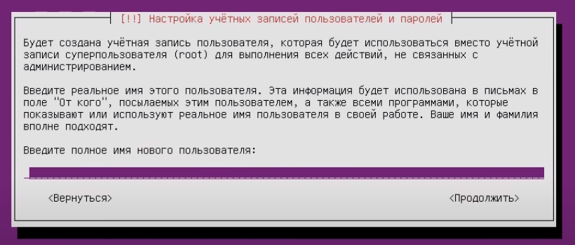
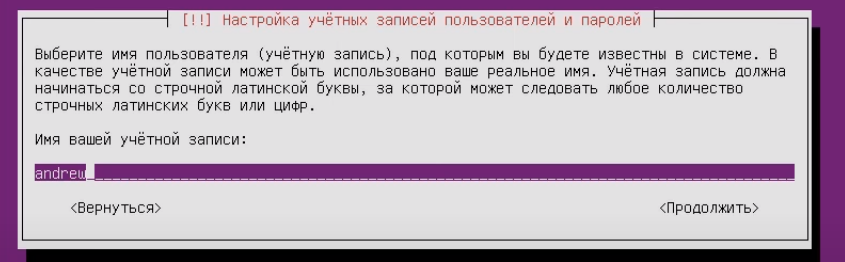
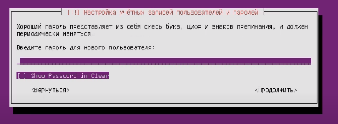
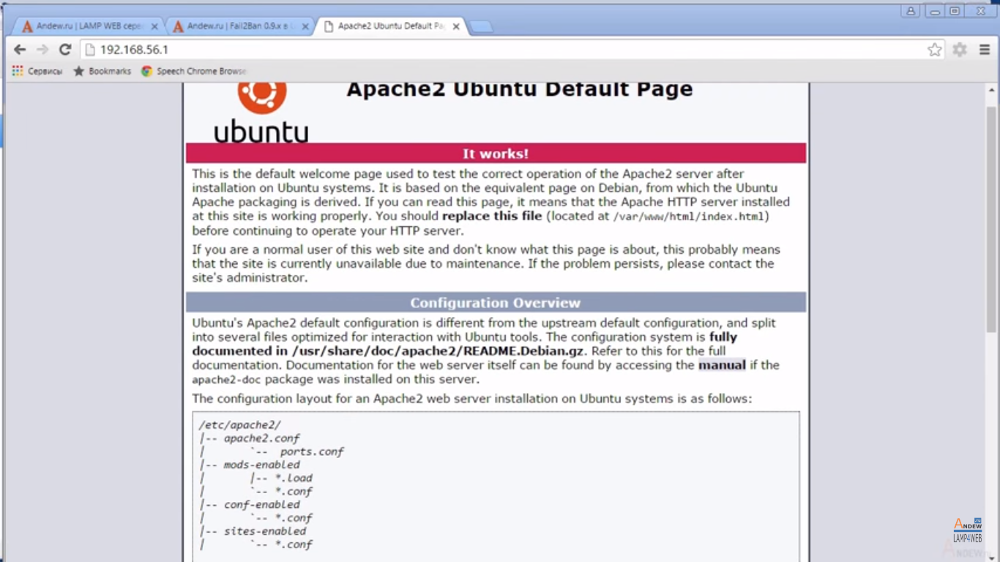
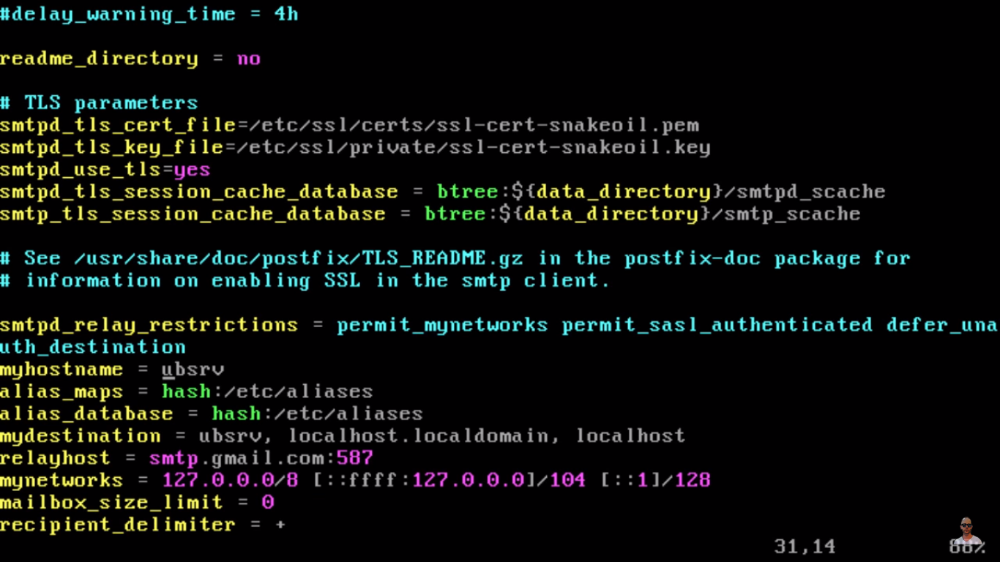
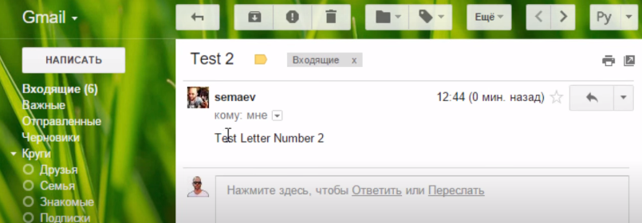
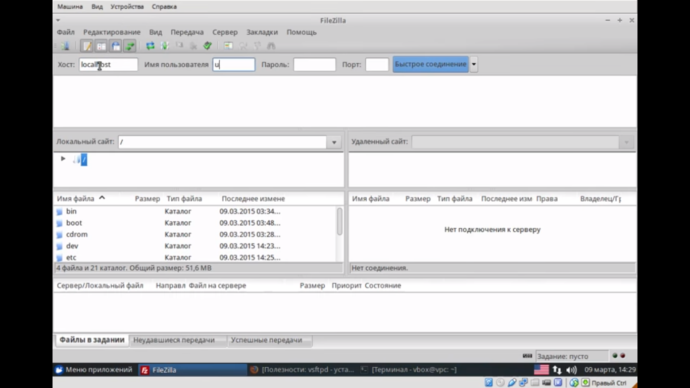

# **Реферат на тему  "Настройка сервера в Linux"**
## **Common information**
discipline: Операционные системы  
group: НПМбд-01-21  
author: Ермолаев А.М.

## **Вступление**
Данный доклад посвящен созданию терминального, файлового (FTP) или почтового сервера на Linux при помощи серверной версии дистрибутива Linux Ubuntu Ubuntu Server.

## **Установка и настройка Ubuntu Server**
Ubuntu Server создана на базе операционной системы Linux.
Скачать образ диска с Linux можно с сайта https://ubuntu.ru/doku.php. Выбрать можно любую версию с Server. Загрузка будет проходить через Torrent-клиент.

Одним из немаловажных плюсов Ubuntu является упрощённый интерфейс. В нём нет никаких графических излишеств. Эта ОС прекрасно подходит, чтобы сделать Linux-сервер своими руками. С ней ресурсы компьютера будут использоваться для нужд домена.

**Этапы установки:**
1) Выбор языка и регион проживания.
2) Ввод имени администратора имя администратора, которое будет использоваться для управления сервером.
3) Задание имя пользователя в поле «Username for your account». Под этим аккаунтом будет происходить общение с техподдержкой Ubuntu.
4) Ввод и подтверждение пароля.
5)Указание домена при наличии. На нём будут находиться все сервисы: файловый (FTP), почтовый, хостинг для сайтов и так далее.
6) Установка дополнительных компонентов.










**Обязательные компоненты**
- Open SSh. 

Используется для удалённого администрирования. 
- LAMP. 

Комплекс утилит Linux, который включает Apache (Web-сервер), MySQL (базы данных) и PHP (язык программирования для CMS). Эти компоненты нужны для создания управляющего интерфейса.

**Необязательные компоненты**
- Samba file server.

Позволяет настроить обмен файлами между компьютерами.
- Virtual Machine host. 

Устанавливайте, если собираетесь пользоваться возможностями виртуализации.
- Print server. 

Сетевые принтеры.
- DNS server. 

Система доменных имён. С ней можно распознать IP-адрес по имени компьютера и наоборот.
- Mail server. 

Почтовый сервер.
- PostgreSQL database. 

Объектно-реляционные базы данных.


После выбора конмпонентов необходимо будет подтвердите установку. При первом запуске надо будет ввести логин администратора и пароль. Откроется консоль.


Изначально надо будет проверить наличие обновлений при помощи одной из команд
```
sudo apt-get update
sudo apt-get upgrade
 ```
После обновления можно перейти к настройке всех компонентов серверов.

## **Локальный Web-сервер**
Для создания Web у сервера должен быть свой выделенный IP. Тогда после установки LAMP по этому IP-адресу будет доступна тестовая страница Apache. В дальнейшем на него можно будет поставить FTP, базы данных, почтовый протокол.

**Настройка Web-сервера**

Дальнейшая работа будет происходить в терминале.
1) Установка phpMyAdmin. 
```
sudo apt-get install phpmyadmin
sudo service apache2 restart
```
После выполнения данных команд будет загружен компонент и перезагружен сервер Apache.

2) Действия, связанные с версией ОС

Ubuntu 13.1
```
sudo ln -s /etc/phpmyadmin/apache.conf /etc/apache2/conf-available/phpmyadmin.conf
sudo a2enconf phpmyadmin
sudo /etc/init.d/apache2 reload
```
Ubuntu 16.04
```
sudo apt-get install php-mbstring php-gettext
sudo phpenmod mcrypt
sudo phpenmod mbstring
sudo systemctl restart apache2
```
После их ввода и автоматического перезапуска службы по адресу 

```http://[iP сервера]/phpmyadmin``` 

будет доступен веб-интерфейс.


Дополнительные сведения
- Конфигурация и данные о ней находятся в папке сервера Apache «etc/apache2/». Apache2.conf — конфигурационный файл для дистрибутива.
- В директориях «mods-available»/«sites-available» и «mods-enabled»/«sites-enabled» находятся моды и сайты.
- В Ports.conf расписаны прослушиваемые порты.
- Если вы добавите после команды
 ```sudo /etc/init.d/apache2``` слово ```Stop```», Apache приостановит работу. Если ```Start``` — снова запустится. Если ```Restart``` — перезагрузится.
- Чтобы самостоятельно выбирать путь для сохранения сайтов, введите в терминал
 ```
 sudo a2enmod rewrite
 sudo a2enmod userdir
 ```

 - Каждый раз после внесения каких-либо изменений надо перезапускать службу командой
 ```
 sudo /etc/init.d/apache2 restart
 ```


 ## **Почтовый сервер**

 Чтобы создать почтовый сервер на Линукс, у вас уже должен быть зарегистрирован домен. Также нужно иметь статический IP.

 **Создание сервера**
 
 1) Установка компонента Postfix
 ```
 sudo apt-get postfix
 ```
2) Для начала работы сервиса необходимо ввести
```
sudo /etc/initd/postfix start
```
3) Настройка параметров в файле ``` /etc/postfix/main.cf```
```
mydomain = <имя домена>
myhostname = <имя машины>
inet_interfaces = all
mynetworks = <диапазон адресов компьютеров>
```


Проверим работу сервера. При ввроде команды
```
echo "Test Letter Number 2" mail -s "Test 2"
```
нам придет соответсвующее письмо.



## **Файловый сервер**
FTP-сервер Linux может понадобиться для обмена документами и загрузки файлов. Существует несколько версий таких ресурсов: vsFTPd, Samba, proFTPd.

**Создание сервера**

1) Установка

```
sudo apt-get install vsftpd
```

2) Дальнейшие настройки(зависят от типа сервиса)
    - Сразу после загрузки программы система создаёт нового пользователя и добавляет в домашнюю директорию папку, которая предназначена для работы с серверным хранилищем. Также в каталоге «etc» появляется файл «ftpusers». Туда можно добавлять пользователей, которым запрещён доступ к файлам.
    - Перемещение файлов в папку «var». 
    ```
    usermod -d /var/ftp ftp && rmdir /home/ftp
    ```
    - Создание группы пользователей
    ```
    addgroup <имя группы>
    ```
    - Добавление нового аккаунта
    ```
    useradd -a /var/ftp -g <имя группы> <имя аккаунта>
    ```
    - Предоставление аккаунту доступ к корневой папке файлового сервера
    ```
    chmod 555 /var/ftp && chown root:userftp /var/ftp
    ```
    - Переписывание файла конфигураций ```etc/vsftpd.conf```
    ```
    listen=YES
    Local_enable=YES (разрешение входа локальным пользователям)
    Write_enable=YES (доступ в домашние каталоги)
    Anonymous_enable=NO (ограничение прав анонимных пользователей)
    ```
    По окончании наш сервер будет иметь следующий вид
    

## Вывод
Создание серверов на Linux удобно и доступно.